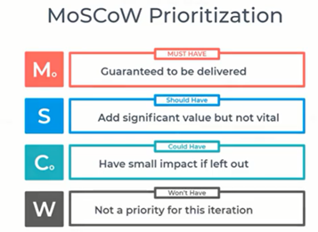
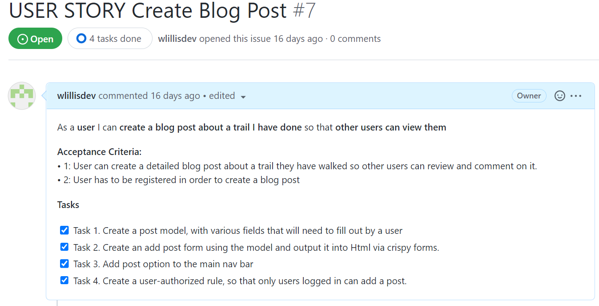
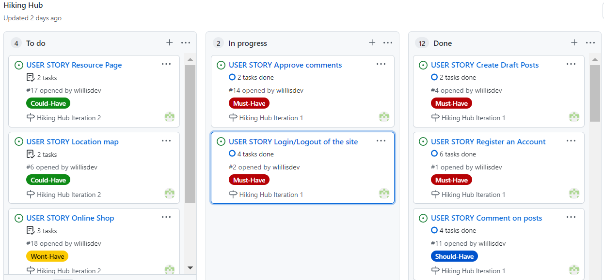
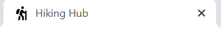
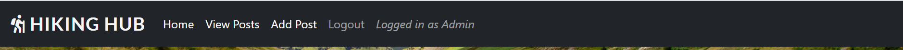
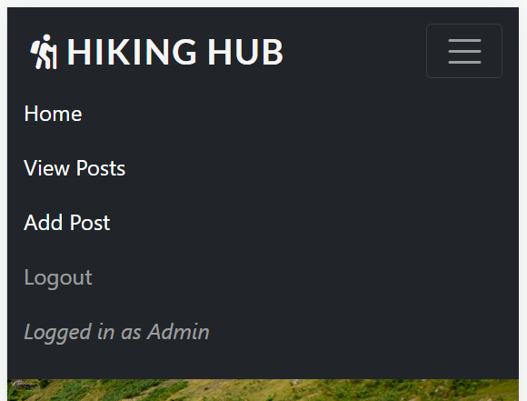
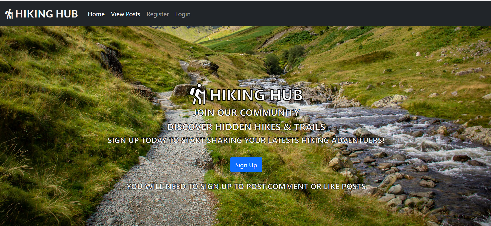
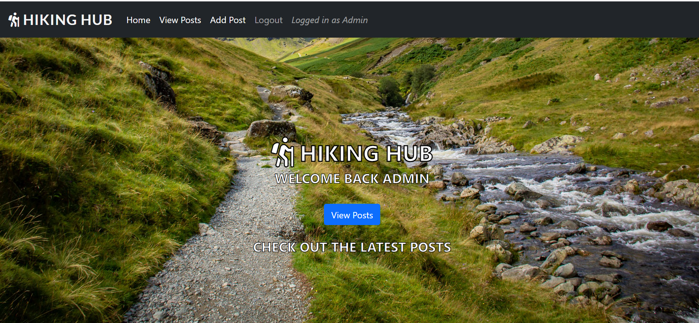
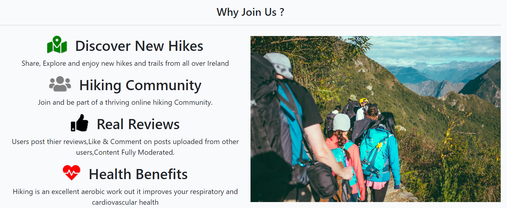

# Hiking Hub

- You can see the live website [here](https://wlillisdev.github.io/quiz-master/)..

This website is designed for Hiking Hub. Their aim is to become the go to blog for everting to do with hikeing in Ireland.

# Aim of Website

The goal of this website is to create an active hiking community blog. To provide a platform so users can share thier hiking adventuers. This blog will enabel users to upload thier own unique hike reviews, And share with others thier expeierence they had on a particular hike or trail. So other users can discover hiden gems of hikes and trails all over Ireland.

# Target Audience

 Hiking is an activity enjoyed by all age groups. But is it recommend that users be aware of the risks involved with hikeing. And not attempt difficult trails if you do not have a guide,relevant experience, proper equipment,colthing and supplies. Primarly the website will be aimed at hikeing enthuists 25+ based in Ireland  

# User Experience (UX)

### User Stories
- First Time Visitors Aims:
  - As a first-time visitor, I want to quickly and easily understand what this website is about and what it can do for me.
  - As a first-time visitor, I want to be able to easily navigate around the site to find the content I'm looking for.
  - As a first-time visitor, I want to be able to register and create an account to get full access to blog
  - As a first-time visitor, I want to quickly view a summary of blog posts on one page.
  - As a first-time visitor, I want to click on a blog post and view the post in detail.
  - As a first-time visitor, I want to be able to see comments and the amount of likes on a blog post.

- Returning Visitors Aims (logged in):
  - As a returning visitor, I would like to be able to add a blog post of my hike.
  - As a returning visitor, I would like to be able to update the content on my blog post.
  - As a returning visitor, I would like to be able to delete my blog post.
  - As a returning visitor, I would like to be able to comment and like and unlike a blog post.
  - As a returning visitor, I would like to be able to quickly log in and log out of my account.
  - As a returning visitor, I would like to find links to their social media channels and follow them.

- Admin super user Aims:
  - As a super user, I want to be able create a blog post from admin panel.
  - As a super user, I want to be able create a draft post so i can finish at a later date.
  - As a super user, I want to be able filter and search through data quickly and easily.
  - As a super user, I want to be able to approve or Delete users blog posts.
  - As a super user, I want to be able to approve or delete comments.

# Agile Approach to Project Devlopment

An agile approach was taken in the devlopment of this project. The project will be  disected into smaller parts and an iterative approach to project management and software development will be used to achieve faster development of the project and optomise time usage.

- MoSoCoW Method:
  - I will also aim to intergate the MoSoCoW Method in to this project. Which is a four-step approach to prioritizing which project requiremnets need to be carried out first in order to achieve project goals and user stories with the first iteration been a fully functioning website. Custom labels will be created in github and allocated to each requirment so they can be easily filtered and identified.

  

- User Stories
  - The whole project was broken down in 18 indivudal user stories,each user story was a self contined devlopemnt mini project that helped reach the overall goal of the website.They were enter into github as github issues.
  - [View List of 18 User Stories](https://github.com/wlillisdev/hiking-hub/issues)
  - Specific accecptance critea was allocated for each user story and a list of  tasks were also established. Each task would need to be completed so accecptance critea is met.See example below.
  
  - The Moscow method was then applied to eash user story. And tags were applied to priortise the order of work.
  - [Example of MOSCOW tags](static/readme/must_have.png)
  - The users stories were then put in to 2 iterations. Iteration 1 had 14 user stories and these were deemed essential for the inital launch of the website. Iteration 2 currently has 4 user stories that will be carried out at a later date.
  - [View Project Iterations](https://github.com/wlillisdev/hiking-hub/milestones)
  - A Kanban board was set up in github in order to manage the various project user stories. It was devided into 3 main area. To Do, In Progress,Done,
  
  -[View Kanban Board](https://github.com/wlillisdev/hiking-hub/projects/1)
  
 
# Responsive 
The website has been designed to operate on a number of screens and devices.The following tests were carried  out on [Am I Responsive](http://ami.responsivedesign.is/)
 - Homepage (displayed below)

 - Quizzes Page [Am I Responsive Test services Page ](assets/readme/services-page-responsive.png)

 - Quizz Page [Am I Responsive Test contact Us Page](assets/readme/quiz-page-responsive.png)
 
 - Contact Us [Am I Responsive Test Thank You Page](assets/readme/contact-responsive.png)

# Features 

 [View Homepage Featuers](https://hikinghub.herokuapp.com/)

__Favicon__
 - As hiking is the theme of the website an icon of a person hiking was used, I came across a solution on stack overflow on how to turn font awsome logo in to favicon. Click [here](https://gauger.io/fonticon/)
  

__Navigation Bar__
 
  - The Navigation bar is located at the top of all  Pages. It is simple but clean design. It includes the logo, Home page, View Posts, Login & Register. this appears to users that are not logged in.
  - If a user has logged it changes, Add Post appears and logout becomes active in the nav bar. It will also display the name of logged in user.
  - It will allow a visitor to quickly and easily get around the site as each link logically leads to the next.
  - The nav elements also change colour when hovered which adds to the user experience.
  - The nav bar is responsive and collpases in to hangburger menu when on smaller screens.   
  - The nav bar below user logged in view.
  
  - The responsive nav bar below.
  - 

 
__Landing Page__

  - The landing page contains an eye-catching background image of a beautiful landscpae with a trail by a stream and immediately catched a users attention.
  - The text on the screen clearly tells the user whats the site is about and what the user needs to do next. And they are encourage to sign up with a bold sign up button.
  - The hero image also has a Parallax Scrolling Effect with the text.
  - The text on the home screen changes depending on if the usere is logged in or not.
  - Landing page below shows the text displayed when new user to site is not registered.
  - 
  - Landing page below shows the text displayed when user logged in.
  - 

__Why Join Us__

- If the useres scrolls down from the hero image, looking for more information. They will come across the section why join us.
- With the help of Font Awsome and some carefully crafted bullets points of text.It outline key aerea of why the user should sign up to this blog.
- 

__About Us & Quiz Category__

  - About Us section is a very brief description about Quiz Master to quickly give the user more information about the company.
  - The Quizz Category section, quickly shows the four main quiz categories.Triva,Sport,Film,Music.
  - Each Category will change color once hovered over, once clicked it will lead the user to the quiz page.

 

__Fact Generator__

  - This is a fun app that will create a new random interesting  fact every time the user clicks on the button.
  - This is aimed at grabbing a new users attention and helping to encourage  a user to click on a quiz after playing.
  - The button has a hover effect and will change color once clicked.

 

__Footer__

  - The footer is simple and clean design it is the same on all pages of the website.
  - It contains 3 social media platforms as requested by Quizz Master they will also open in a new window to allow easy navigation for the user.
  - The main aim of the footer is to increase engagement with visitors.With the goal of getting the user to subscribe to the channel in order to get updates on new quizzes. 

 

- __Hoover__

  - Each clickable element on the website changes color when hovered over with a mouse. This is to encourage users to click on buttons and links and increase engagement and user experience.
  

__Quizzes Page__

  -  This page clearly lays out the main quiz topics. The user can easily navigate to the diffrent quizzes.
  - Each specific quiz category has an eye catching image in relation to the different topics. Each topic has a button type icon in the centre of it that also has a hover effect to improve the users experience.
  - At the bottom of the page there is an interactive google map. The map has various markers at locations all around the world.
  - When the user clicks on the marker a info window appears and the users can view an interesting fact from this location.
  - This is aimed at improving  the users engagement  on the site. As all quiz lovers enjoys interesting  facts and information this map will cater for this need and provide some fun for the user as they take a break between quizzes.
  
  - Quizzes Page
 

 - Quizzes Page Google Map Feature
 

  [View Quizzes Page Featuers](https://wlillisdev.github.io/quiz-master/quizzes.html)

__Quiz Page__

  -  The quiz page is the same format on all quizzes, 5 questions with a multiple choice of 3 answers per question.The user answer is easily and quickly recorder in a radio input.

  - Quiz Page
 

  - The user has to answer all questions for the quiz to be successful. If they don't they will be given an alert saying you have missed a question.

  - Alert warning
 

  - At the end of the quiz the user presses get results  button, And a message tells them how many questions they have got correct.
  - The results is also accompanied with a GIF image, there a 3 different  images that relate to different  score ranges.
  - GIF for All Correct
  
  - The answers to the questions are also revealed  once the user has submitted at the end of the quiz.  
  
  [View Quiz Page Featuers](https://wlillisdev.github.io/quiz-master/quizz-triva.html)

__Contact Us Page__

 [View Contact Us Featuers](https://wlillisdev.github.io/quiz-master/contact-us.html)

  - It has a simple but elegant contact us form layout. That captures enough information so Quiz Master can follow up on the lead. And allows a user’s to quickly fill out the form with minimal information.
  - It also has a video background of question marks. It continues the animation theme and quesion mark logo from the home page it is fun and interesting.
 
 

__Thank You Page__
  - When the user successfully submits the contact us form, they will be brought to a thank you page. Which will also encourage the user to check out our social channels.
  

# Design
 - Theme
   - The Theme of the website was to build a bright and engaging Quiz website with a blend of both quizzes and fun. 
   - Fonts were imported from google fonts, Boogaloo was used for the logo and nav menu, Libre Franklin for hompage hero text, Montserrat for headings, and Roboto for body text.These were picked as they were crisp and complimented each other and the theme of the site.

 - Color Palette
   - The color palette is made up of four main colors which creates a good contrast and helps support the overall theme.

 

- Imagery
   - The images that were selected for the website were bold and bright images related to the Quiz Genre.

- Wireframes
   - To create the initial layout and wireframe I used Balsamiq. This helped fine tune the design and layout. It also helped in calculating the amount of content and images required.

  - 
  - [Quizzes Page Wireframe Concept](assets/readme/quizzes-wireframe-new.png)
  - [Quizz Page Wireframe Concept](assets/readme/quizz-wireframe.png)
   

# Future Development

- More Quiz Topics
  - As the site grows so will the resource of quiz topics and questions.

  - As the site grows we will intergrate an API into the random fact generator to generate an  infinite amount of new facts.        

- Children Quizzes 
  - Children Quizzes section will be added at a later date, to broaden the reach of the website.

- Subscription Section
  - The site will initially  have a number of quizzes free for everyone. But there will be an option for users to sign up to a monthly subscription service where they get exclusive quizzes every month.

- Other Games
  - As the site evolves  so will the amount of games on the site, initially  it is just quizzes, but it eventually have Crosswords, Word Search & Cryptograms.  

# Testing

### Validator Testing 

 - HTML Validator
   - [W3C](https://validator.w3.org/) site was used to validate the **HTML** code.
   - A number of small errors were initially flagged up. Some duplicate tags were removed and I also had to rename a number of images. I also misplaced a link tag in the homepage, as I copied this page structure for the rest of the site i had to fix it on all of these pages also
     - [Erros From Validator Hompage](assets/readme/html-home-error.png)
     - [Erros From Validator Quizzes](assets/readme/error-validator-quizzes.png)
     - [Erros From Validator Triva Quiz](assets/readme/validaor-error-triva-quiz.png)

   

 ### All Pages are now error free see links below:

 
   - [Homepage](https://validator.w3.org/nu/?doc=https%3A%2F%2Fwlillisdev.github.io%2Fquiz-master%2Findex.html)
   - [Quizzes Page](https://validator.w3.org/nu/?doc=https%3A%2F%2Fwlillisdev.github.io%2Fquiz-master%2Fquizzes.html)
   - [Triva Quizz](https://validator.w3.org/nu/?doc=https%3A%2F%2Fwlillisdev.github.io%2Fquiz-master%2Fquizz-triva.html) Error because image is hidden until event happens
   - [Sport Quizz](https://validator.w3.org/nu/?doc=https%3A%2F%2Fwlillisdev.github.io%2Fquiz-master%2Fsport-quizz.html) Error because image is hidden until event happens
   - [Film Quizz](https://validator.w3.org/nu/?doc=https%3A%2F%2Fwlillisdev.github.io%2Fquiz-master%2Ffilm-quizz.html) Error because image is hidden until event happens
   - [Film Quizz](https://validator.w3.org/nu/?doc=https%3A%2F%2Fwlillisdev.github.io%2Fquiz-master%2Fmusic-quizz.html) Error because image is hidden until event happens
   - [Contact Us Page](https://validator.w3.org/nu/?doc=https%3A%2F%2Fwlillisdev.github.io%2Fquiz-master%2Fcontact-us.html)
   - [Thank You Page](https://validator.w3.org/nu/?doc=https%3A%2F%2Fwlillisdev.github.io%2Fquiz-master%2Fthank-you.html)

## CSS Validator
  - The [W3C](https://validator.w3.org/) was used to validate the **CSS** code
  - The website passed with no errors

  

  ### See links below for Results:

   - [CSS Test Results](https://jigsaw.w3.org/css-validator/validator?uri=https%3A%2F%2Fwlillisdev.github.io%2Fquiz-master%2Findex.html&profile=css3svg&usermedium=all&warning=1&vextwarning=&lang=en)

 
## Lighthouse
 - Lighthouse testing was carried out in Developer Tools in Chrome. Initially it gave a number of improvements and flagged up a number of images that needed to be reduced in size. Which was done.

 - The results were also skewed as the chrome extensions on my testing device was affecting the lighthouse results. The tests of all pages were redone in a incognito window and performance score increased.

 
 - [Quizzes Page lighthouse results](assets/readme/quizzes-pages-lighthouse.png) results are slightly down mainly due to the integration  of google maps api.
 - [Contact Us lighthoust results](assets/readme/contact-lighthouse-crop.png)

 ## JavaScript
 - The [JShint](https://jshint.com/) was used to validate the **JavaScrip** code
 - The results initally highlighted a few warnings.
     - [Erros From JShint](assets/readme/jshint-error.png)
     
 - Each item was addressed, The validation loop for the quizz was edited to remove eval as Jshint highlighted it could be harmful for security issues. And stack overflow suggested adding / /*jshint esversion: 6 */ to the notes this prevented this error.

 
 
## Manual Testing
  - All the site links were manually tested to see if they all worked ok and linked to the correct locations.
  - The form was checked that name and email were required, that the radio buttons functioned and that the submit button worked.
  - The site was further tested using feedback from mentor,family and friends who checked it on different  devices they had.
  - All of the page's features were tested on Google Chrome, Microsoft Edge, Mozilla Firefox, Safari, and Opera .
  - Google Chrome's Developer Tool was used to inspect page elements during the build and helped identify  and debug issues within the HTML and CSS.
  - The README.md was checked before final submission and links verified.

# Bugs

  - After running the site through HTML checker, a number of small bugs were identified. Each error was identified and an appropriate solution applied, i went through all pages and fixed any errors. It was good lesson and practice in finding problems with code and fixing them.
  - After Running all the pages through lighthouse, it identified issues with a number of images due to size. Lighthouse suggested to change some larger images which was done.
  - Initially  i had a mouse over event listener  on google maps markers but this was no use for mobile which i realised  when testing, so i changed it to onclick event.
  - I had eval in my validate quiz function, jshint gave this as a warning and a potential security risk so i removed it.
  

  # Unfixed Bugs
  - I am aware there is a console.log Error with Permissions-Policy header: Unrecognized feature: 'interest-cohort'.From what i have researched this is a issue between Github and Google and has no effect on the sites performance.
  - I am aware the website has a lot of large rich images and although images were cropped and compressed it could lead to reduced speed until cached. I have experimented with next gen image formats but currently  they lack browser compatibility  so i just went with png compressed and cropped format for this site.

# Deployment

The site was created using Visual Studio Code and GitHub, and deployed to GitHub pages for testing using the below process:

 - Clicked on my respository for [wlillisdev/quizz-master](https://github.com/wlillisdev/quiz-master).
 - Clicked settings tab and navigated down to "pages"
 - Selected "Main" in branch drop down box.
 - Clicked "save" which produced the live link which can be viewed [here](https://wlillisdev.github.io/quiz-master/).. 

 ## Version Control
  - Git was used as the version control software. Commands such as git add ., git status, git commit and git push were used to add, save, stage and push the code to the GitHub repository.

## Cloning

1. On [GitHub](www.github.com), navigate to the main page of the repository.  [Click Here for Reposititory Link](https://github.com/wlillisdev/quiz-master)

2. Above the list of files, click Code.

3. click Use GitHub CLI, then click the copy icon.

4. Open Git Bash and change the current working directory to the location where you want the cloned directory.

5. Type git clone, and then paste the URL that was copied previously  in step 3.

6. Press Enter to create the local clone.

[git cloning steps with pictuers](https://docs.github.com/en/repositories/creating-and-managing-repositories/cloning-a-repository#cloning-a-repository-to-github-desktop)

# Credits

- ## Languages

  - [HTML5](https://en.wikipedia.org/wiki/HTML5)
  - [CSS](https://en.wikipedia.org/wiki/CSS)
  - [JavaScript](https://en.wikipedia.org/wiki/JavaScript)

- ## Content
   - The code for the contact us form was taken from the love running tutorial from [Code Institute](https://codeinstitute.net/ie/) and modified.
   - The icons used throughout the site were from [Font Awesome](https://fontawesome.com/)
   - Variour Youtube tutorial were used to help understand flexbox.
   - [Flexbox](https://www.youtube.com/watch?v=fYq5PXgSsbE)
   - Animated Text on home page from [bulldogpatch](https://codepen.io/bulldogpatch-the-sasster/pen/JjoyeGg)
   - Tutorials for Randon Fact generator from freecode camp ,learn web-dev & dev.to were used to inspire the generator.
   - YouTube videos from Eduonix Learning Solutions,Kevin Briggs & Web Dev Simplified were used as a base for the quizz.
   - Youtube videos about google maps api with javascript were followed from Traversy Media & Sam Codes.

    

-  ## Images
   - All images were taken from [Pexels](https://www.pexels.com/)

  
 -  ## Resources
    - [Stack Overflow](https://stackoverflow.com/)
    - [W3Schools](https://www.w3schools.com/)
    - [w3docs](https://www.w3docs.com/)
    - Notes & Videos from course work from [Code Institute](https://codeinstitute.net/ie/)

-  ## Tools
   - [Balsamiq](https://balsamiq.com/) - Used to create wireframes
   - [Google Fonts](https://fonts.google.com/) - Used to import fonts
   - [TinyPNG](https://tinypng.com/) - Used to compress images

-  ## Acknowledgements
 - Special thanks to my mentor Miguel Martinez
 for his help and guidance in the development of my project. Special thanks to my tutor Kasia and our regular class meeting’s and members of the awesome slack community

   # Conclusion
    - I would like to experiment more with javaScript but as i am only getting to grips with the language i kept the concept simple.
    - If I was to build this site again, I would spend more time on the wireframes and know exactly how to structure each section and element before i start.
    - If i had time i would like to add a timer function to the quizz.    
    - I would also learn to make more commits during the project built.

This website is designed for Hiking Hub. The go to blog and resource for everything to do with hiking in Ireland.

# Aim of Website

The goal of the website is to create an active and vibrant hiking community online. It will provide a platform where users can post their latest’s hiking adventures. And for other users to interact and discuss different hikes get hints and tips and find hidden gems of hikes and trails all over Ireland.

# Target Audience

Hiking is suitable for everybody and any age group. But it is recommended that users be aware of the risks involved in hiking and never undertake a difficult hike if they don’t have a guide, experience, suitable equipment or clothing. Primarily the audience will be aimed at the hiking enthusiasts 25+ based in Ireland.

# User Experience (UX)

### User Stories

- First Time Visitors Aims:
  - As a first-time visitor, I want to quickly and easily understand what this website is about and what it can do for me.
  - As a first-time visitor, I want to be able to easily navigate around the site to find the content I'm looking for.
  - As a first-time visitor, I want to quickly view a summary of blog posts on a page.
  - As a first-time visitor, I want to click on blog post and view it full contents in detail.
  - As a first-time visitor, I want to sign up and register an account so I can have full access to site.
  - As a first-time visitor, I want view comments and likes on a post to see the most popular posts quickly

  
- Returning Visitors Aims (logged in users):
 
  - As a returning visitor, I would like to view new blog posts.
  - As a returning visitor, I would like to add my own blog post.
  - As a returning visitor, I would like to be able to like or unlike and comment on blog posts.
  - As a returning visitor, I would like like to update a previous blog post I created.
  - As a returning visitor, I would like to be able to delete a previous blog post I created.
  - As a returning visitor, I would like to be able to log out of my account.
  - As a returning visitor, I want to learn more about the hiking hub.
  - As a returning visitor, I would like to find links to their social media channels and follow them.

- As a site Admin Super User:
  - As a superuser, I would like to create a blog post from the admin panel.
  - As a superuser, I would like create a draft blog post so i can finish at a later point.
  - As a superuser, I would like to be able to apply filters to find and sort information.
  - As a superuser, I would like to review all blog posts before they are published to site.
  - As a superuser, I would like to review all comments before they are published to site.
  - As a superuser, I would like to be able to delete,useres,blog posts and comments.

# Agile Approach to Project Devopment
 - An agile approach was used in order to devlop and build the Hiking Hub. Each activity was broken down into smaller more manageable packages. This Agile irrativte approach to project management will ensure that the final working project will be devloped faster and with fewer problems.

 -  MoSCoW 
    - I will also implement the MoSoCoW method which is a four-step approach to prioritising project requirements. This will proritise the essential project requirments that will need to be delivered in the first itteration. Unique labels were created in in github project to be applied to easily filter and proritise issues.

    

 -  User Stories
    - The whole project was broken down into a total of 18 user stories and documents in github as Github Issues. 
    - [View 18 User Stories](https://github.com/wlillisdev/hiking-hub/issues)
    - Each user story was further broken down in to the accecpatance critea for each user story and the tasks that will have to be carried out in order to deliver this user story sucessfully.
    
    - Each user story was then given a label from MoSCoW to identify the most important and essentail elements that would need to be deliverd in the first itteration of the project.
    - [View Some Must Have user stories](static/readme/must_have.png)
    - The users stories with the help of MOSCOW were broken down into 2 iterations. Iteration one would deliver a fully funtioning website with key featuers. And iteration2 would deliver the remaining featuers that were not delivered in itteration 1 to be completed at a later date.
    - [View Itererations](https://github.com/wlillisdev/hiking-hub/milestones)
    - The focus then went to the Kanban board created in github. This was used to project manage and track the progress of each issue.
    - [View Kanban Board](https://github.com/wlillisdev/hiking-hub/projects/1)

    

    

# Responsive 
The website has been designed to operate on a number of screens and devices.The following tests were carried  out on [Am I Responsive](http://ami.responsivedesign.is/)
 - Homepage (displayed below)

 - Quizzes Page [Am I Responsive Test services Page ](assets/readme/services-page-responsive.png)

 - Quizz Page [Am I Responsive Test contact Us Page](assets/readme/quiz-page-responsive.png)
 
 - Contact Us [Am I Responsive Test Thank You Page](assets/readme/contact-responsive.png)

# Features 

 [View Homepage Featuers](https://wlillisdev.github.io/quiz-master/index.html)

__Favicon__
 - As the company logo is a question mark i combined this with yellow branding to make an eye catching Favicon.
  

__Navigation Bar__
 
  - The Navigation bar is located at the top of all  Pages. It is simple but clean design. It includes the logo, Home page, Quizzes and Contact Us page.
  - It will allow a visitor to quickly and easily get around the site as each link logically leads to the next.
  - The nav elements also change colour when hovered over and also has an active line under each link when clicked which adds to the user experience.  

 

__Landing Page__

  - The landing page contains an eye-catching background image of a shelves of books that infers the theme of knowledge and quizzes.
  - The text are you ready for  is animated  on page load and catches the users attention straight  away, it is bold and white and contrasts well with background image.
  - It also has a call to action with a button i want to play,that jumps to the category section of the homepage.

 

__About Us & Quiz Category__

  - About Us section is a very brief description about Quiz Master to quickly give the user more information about the company.
  - The Quizz Category section, quickly shows the four main quiz categories.Triva,Sport,Film,Music.
  - Each Category will change color once hovered over, once clicked it will lead the user to the quiz page.

 

__Fact Generator__

  - This is a fun app that will create a new random interesting  fact every time the user clicks on the button.
  - This is aimed at grabbing a new users attention and helping to encourage  a user to click on a quiz after playing.
  - The button has a hover effect and will change color once clicked.

 

__Footer__

  - The footer is simple and clean design it is the same on all pages of the website.
  - It contains 3 social media platforms as requested by Quizz Master they will also open in a new window to allow easy navigation for the user.
  - The main aim of the footer is to increase engagement with visitors.With the goal of getting the user to subscribe to the channel in order to get updates on new quizzes. 

 

- __Hoover__

  - Each clickable element on the website changes color when hovered over with a mouse. This is to encourage users to click on buttons and links and increase engagement and user experience.
  

__Quizzes Page__

  -  This page clearly lays out the main quiz topics. The user can easily navigate to the diffrent quizzes.
  - Each specific quiz category has an eye catching image in relation to the different topics. Each topic has a button type icon in the centre of it that also has a hover effect to improve the users experience.
  - At the bottom of the page there is an interactive google map. The map has various markers at locations all around the world.
  - When the user clicks on the marker a info window appears and the users can view an interesting fact from this location.
  - This is aimed at improving  the users engagement  on the site. As all quiz lovers enjoys interesting  facts and information this map will cater for this need and provide some fun for the user as they take a break between quizzes.
  
  - Quizzes Page
 

 - Quizzes Page Google Map Feature
 

  [View Quizzes Page Featuers](https://wlillisdev.github.io/quiz-master/quizzes.html)

__Quiz Page__

  -  The quiz page is the same format on all quizzes, 5 questions with a multiple choice of 3 answers per question.The user answer is easily and quickly recorder in a radio input.

  - Quiz Page
 

  - The user has to answer all questions for the quiz to be successful. If they don't they will be given an alert saying you have missed a question.

  - Alert warning
 

  - At the end of the quiz the user presses get results  button, And a message tells them how many questions they have got correct.
  - The results is also accompanied with a GIF image, there a 3 different  images that relate to different  score ranges.
  - GIF for All Correct
  
  - The answers to the questions are also revealed  once the user has submitted at the end of the quiz.  
  
  [View Quiz Page Featuers](https://wlillisdev.github.io/quiz-master/quizz-triva.html)

__Contact Us Page__

 [View Contact Us Featuers](https://wlillisdev.github.io/quiz-master/contact-us.html)

  - It has a simple but elegant contact us form layout. That captures enough information so Quiz Master can follow up on the lead. And allows a user’s to quickly fill out the form with minimal information.
  - It also has a video background of question marks. It continues the animation theme and quesion mark logo from the home page it is fun and interesting.
 
 

__Thank You Page__
  - When the user successfully submits the contact us form, they will be brought to a thank you page. Which will also encourage the user to check out our social channels.
  

# Design
 - Theme
   - The Theme of the website was to build a bright and engaging Quiz website with a blend of both quizzes and fun. 
   - Fonts were imported from google fonts, Boogaloo was used for the logo and nav menu, Libre Franklin for hompage hero text, Montserrat for headings, and Roboto for body text.These were picked as they were crisp and complimented each other and the theme of the site.

 - Color Palette
   - The color palette is made up of four main colors which creates a good contrast and helps support the overall theme.

 

- Imagery
   - The images that were selected for the website were bold and bright images related to the Quiz Genre.

- Wireframes
   - To create the initial layout and wireframe I used Balsamiq. This helped fine tune the design and layout. It also helped in calculating the amount of content and images required.

  - 
  - [Quizzes Page Wireframe Concept](assets/readme/quizzes-wireframe-new.png)
  - [Quizz Page Wireframe Concept](assets/readme/quizz-wireframe.png)
   

# Future Development

- More Quiz Topics
  - As the site grows so will the resource of quiz topics and questions.

  - As the site grows we will intergrate an API into the random fact generator to generate an  infinite amount of new facts.        

- Children Quizzes 
  - Children Quizzes section will be added at a later date, to broaden the reach of the website.

- Subscription Section
  - The site will initially  have a number of quizzes free for everyone. But there will be an option for users to sign up to a monthly subscription service where they get exclusive quizzes every month.

- Other Games
  - As the site evolves  so will the amount of games on the site, initially  it is just quizzes, but it eventually have Crosswords, Word Search & Cryptograms.  

# Testing

### Validator Testing 

 - HTML Validator
   - [W3C](https://validator.w3.org/) site was used to validate the **HTML** code.
   - A number of small errors were initially flagged up. Some duplicate tags were removed and I also had to rename a number of images. I also misplaced a link tag in the homepage, as I copied this page structure for the rest of the site i had to fix it on all of these pages also
     - [Erros From Validator Hompage](assets/readme/html-home-error.png)
     - [Erros From Validator Quizzes](assets/readme/error-validator-quizzes.png)
     - [Erros From Validator Triva Quiz](assets/readme/validaor-error-triva-quiz.png)

   

 ### All Pages are now error free see links below:

 
   - [Homepage](https://validator.w3.org/nu/?doc=https%3A%2F%2Fwlillisdev.github.io%2Fquiz-master%2Findex.html)
   - [Quizzes Page](https://validator.w3.org/nu/?doc=https%3A%2F%2Fwlillisdev.github.io%2Fquiz-master%2Fquizzes.html)
   - [Triva Quizz](https://validator.w3.org/nu/?doc=https%3A%2F%2Fwlillisdev.github.io%2Fquiz-master%2Fquizz-triva.html) Error because image is hidden until event happens
   - [Sport Quizz](https://validator.w3.org/nu/?doc=https%3A%2F%2Fwlillisdev.github.io%2Fquiz-master%2Fsport-quizz.html) Error because image is hidden until event happens
   - [Film Quizz](https://validator.w3.org/nu/?doc=https%3A%2F%2Fwlillisdev.github.io%2Fquiz-master%2Ffilm-quizz.html) Error because image is hidden until event happens
   - [Film Quizz](https://validator.w3.org/nu/?doc=https%3A%2F%2Fwlillisdev.github.io%2Fquiz-master%2Fmusic-quizz.html) Error because image is hidden until event happens
   - [Contact Us Page](https://validator.w3.org/nu/?doc=https%3A%2F%2Fwlillisdev.github.io%2Fquiz-master%2Fcontact-us.html)
   - [Thank You Page](https://validator.w3.org/nu/?doc=https%3A%2F%2Fwlillisdev.github.io%2Fquiz-master%2Fthank-you.html)

## CSS Validator
  - The [W3C](https://validator.w3.org/) was used to validate the **CSS** code
  - The website passed with no errors

  

  ### See links below for Results:

   - [CSS Test Results](https://jigsaw.w3.org/css-validator/validator?uri=https%3A%2F%2Fwlillisdev.github.io%2Fquiz-master%2Findex.html&profile=css3svg&usermedium=all&warning=1&vextwarning=&lang=en)

 
## Lighthouse
 - Lighthouse testing was carried out in Developer Tools in Chrome. Initially it gave a number of improvements and flagged up a number of images that needed to be reduced in size. Which was done.

 - The results were also skewed as the chrome extensions on my testing device was affecting the lighthouse results. The tests of all pages were redone in a incognito window and performance score increased.

 
 - [Quizzes Page lighthouse results](assets/readme/quizzes-pages-lighthouse.png) results are slightly down mainly due to the integration  of google maps api.
 - [Contact Us lighthoust results](assets/readme/contact-lighthouse-crop.png)

 ## JavaScript
 - The [JShint](https://jshint.com/) was used to validate the **JavaScrip** code
 - The results initally highlighted a few warnings.
     - [Erros From JShint](assets/readme/jshint-error.png)
     
 - Each item was addressed, The validation loop for the quizz was edited to remove eval as Jshint highlighted it could be harmful for security issues. And stack overflow suggested adding / /*jshint esversion: 6 */ to the notes this prevented this error.

 
 
## Manual Testing
  - All the site links were manually tested to see if they all worked ok and linked to the correct locations.
  - The form was checked that name and email were required, that the radio buttons functioned and that the submit button worked.
  - The site was further tested using feedback from mentor,family and friends who checked it on different  devices they had.
  - All of the page's features were tested on Google Chrome, Microsoft Edge, Mozilla Firefox, Safari, and Opera .
  - Google Chrome's Developer Tool was used to inspect page elements during the build and helped identify  and debug issues within the HTML and CSS.
  - The README.md was checked before final submission and links verified.

# Bugs

  - After running the site through HTML checker, a number of small bugs were identified. Each error was identified and an appropriate solution applied, i went through all pages and fixed any errors. It was good lesson and practice in finding problems with code and fixing them.
  - After Running all the pages through lighthouse, it identified issues with a number of images due to size. Lighthouse suggested to change some larger images which was done.
  - Initially  i had a mouse over event listener  on google maps markers but this was no use for mobile which i realised  when testing, so i changed it to onclick event.
  - I had eval in my validate quiz function, jshint gave this as a warning and a potential security risk so i removed it.
  

  # Unfixed Bugs
  - I am aware there is a console.log Error with Permissions-Policy header: Unrecognized feature: 'interest-cohort'.From what i have researched this is a issue between Github and Google and has no effect on the sites performance.
  - I am aware the website has a lot of large rich images and although images were cropped and compressed it could lead to reduced speed until cached. I have experimented with next gen image formats but currently  they lack browser compatibility  so i just went with png compressed and cropped format for this site.

# Deployment

The site was created using Visual Studio Code and GitHub, and deployed to GitHub pages for testing using the below process:

 - Clicked on my respository for [wlillisdev/quizz-master](https://github.com/wlillisdev/quiz-master).
 - Clicked settings tab and navigated down to "pages"
 - Selected "Main" in branch drop down box.
 - Clicked "save" which produced the live link which can be viewed [here](https://wlillisdev.github.io/quiz-master/).. 

 ## Version Control
  - Git was used as the version control software. Commands such as git add ., git status, git commit and git push were used to add, save, stage and push the code to the GitHub repository.

## Cloning

1. On [GitHub](www.github.com), navigate to the main page of the repository.  [Click Here for Reposititory Link](https://github.com/wlillisdev/quiz-master)

2. Above the list of files, click Code.

3. click Use GitHub CLI, then click the copy icon.

4. Open Git Bash and change the current working directory to the location where you want the cloned directory.

5. Type git clone, and then paste the URL that was copied previously  in step 3.

6. Press Enter to create the local clone.

[git cloning steps with pictuers](https://docs.github.com/en/repositories/creating-and-managing-repositories/cloning-a-repository#cloning-a-repository-to-github-desktop)

# Credits

- ## Languages

  - [HTML5](https://en.wikipedia.org/wiki/HTML5)
  - [CSS](https://en.wikipedia.org/wiki/CSS)
  - [JavaScript](https://en.wikipedia.org/wiki/JavaScript)

- ## Content
   - The code for the contact us form was taken from the love running tutorial from [Code Institute](https://codeinstitute.net/ie/) and modified.
   - The icons used throughout the site were from [Font Awesome](https://fontawesome.com/)
   - Variour Youtube tutorial were used to help understand flexbox.
   - [Flexbox](https://www.youtube.com/watch?v=fYq5PXgSsbE)
   - Animated Text on home page from [bulldogpatch](https://codepen.io/bulldogpatch-the-sasster/pen/JjoyeGg)
   - Tutorials for Randon Fact generator from freecode camp ,learn web-dev & dev.to were used to inspire the generator.
   - YouTube videos from Eduonix Learning Solutions,Kevin Briggs & Web Dev Simplified were used as a base for the quizz.
   - Youtube videos about google maps api with javascript were followed from Traversy Media & Sam Codes.

    

-  ## Images
   - All images were taken from [Pexels](https://www.pexels.com/)

  
 -  ## Resources
    - [Stack Overflow](https://stackoverflow.com/)
    - [W3Schools](https://www.w3schools.com/)
    - [w3docs](https://www.w3docs.com/)
    - Notes & Videos from course work from [Code Institute](https://codeinstitute.net/ie/)

-  ## Tools
   - [Balsamiq](https://balsamiq.com/) - Used to create wireframes
   - [Google Fonts](https://fonts.google.com/) - Used to import fonts
   - [TinyPNG](https://tinypng.com/) - Used to compress images

-  ## Acknowledgements
 - Special thanks to my mentor Miguel Martinez
 for his help and guidance in the development of my project. Special thanks to my tutor Kasia and our regular class meeting’s and members of the awesome slack community

   # Conclusion
    - I would like to experiment more with javaScript but as i am only getting to grips with the language i kept the concept simple.
    - If I was to build this site again, I would spend more time on the wireframes and know exactly how to structure each section and element before i start.
    - If i had time i would like to add a timer function to the quizz.    
    - I would also learn to make more commits during the project built.