# Hiking Hub

- You can see the live website [here](https://hikinghub.herokuapp.com/)..

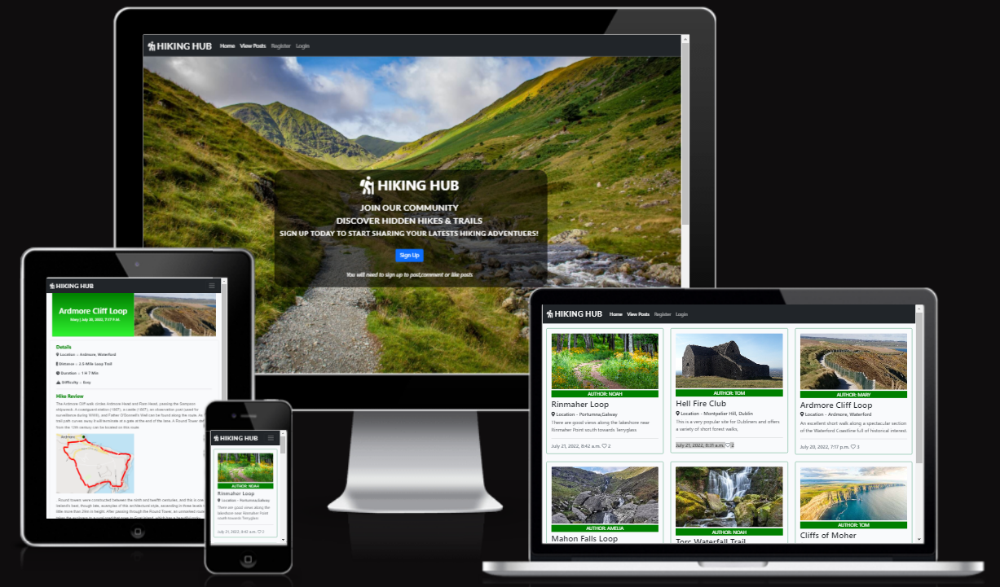

This website is designed for Hiking Hub. Their aim is to become the go to blog for everything to do with hiking in Ireland.

# Aim of Website

The goal of this website is to create a hiking community blog. To provide a platform so users can share thier hiking adventuers. This blog will enable users to upload thier own unique hike reviews, And share with others thier expeierence they had on a particular hike or trail. So other users can discover hiden gems of hikes and trails all over Ireland.

# Target Audience

 Hiking is an activity enjoyed by all age groups. But is it recommend that users be aware of the risks involved with hiking. And not attempt difficult trails if you do not have a guide,relevant experience, proper equipment,colthing and supplies. Primarly the website will be aimed at hiking enthuists 25+ based in Ireland  

# User Experience (UX)

### User Stories
- First Time Visitors Aims:
  - As a first-time visitor, I want to quickly and easily understand what this website is about and what it can do for me.
  - As a first-time visitor, I want to be able to easily navigate around the site to find the content I'm looking for.
  - As a first-time visitor, I want to be able to register and create an account to get full access to blog
  - As a first-time visitor, I want to quickly view a summary of blog posts on one page.
  - As a first-time visitor, I want to click on a blog post and view the post in detail.
  - As a first-time visitor, I want to be able to see comments and the amount of likes on a blog post.

- Returning Visitors Aims (logged in):
  - As a returning visitor, I would like to be able to add a blog post of my hike.
  - As a returning visitor, I would like to be able to update the content on my blog post.
  - As a returning visitor, I would like to be able to delete my blog post.
  - As a returning visitor, I would like to be able to comment and like and unlike a blog post.
  - As a returning visitor, I would like to be able to quickly log in and log out of my account.
  - As a returning visitor, I would like to find links to their social media channels and follow them.

- Admin super user Aims:
  - As a super user, I want to be able create a blog post from admin panel.
  - As a super user, I want to be able create a draft post so i can finish at a later date.
  - As a super user, I want to be able filter and search through data quickly and easily.
  - As a super user, I want to be able to approve or Delete users blog posts.
  - As a super user, I want to be able to approve or delete comments.

# Agile Approach to Project Devlopment

An agile approach was taken in the devlopment of this project. The project will be  disected into smaller parts and an iterative approach to project management and development will be used to achieve faster development of the project and optomise time usage.

- MoSoCoW Method:
  - I will also aim to intergate the MoSoCoW Method in to this project. Which is a four-step approach to prioritizing which project requiremnets need to be carried out first in order to achieve project goals and criteria of user stories. Custom labels will be created in github and allocated to each requirment so they can be easily filtered and identified.

  

- User Stories
  - The whole project was broken down in 18 indivudal user stories,each user story was a self contined devlopemnt mini project that helped reach the overall goal of the website.They were enter into github as github issues.
  - [View List of 18 User Stories](https://github.com/wlillisdev/hiking-hub/issues)
  - Specific accecptance critea was allocated for each user story and a list of  tasks were also established. Each task would need to be completed to ensure accecptance critea is met.See example below.
  
  - The Moscow method was then applied to eash user story. And tags were applied to priortise the order of work.
  - [Example of MOSCOW tags](static/readme/must_have.png)
  - The users stories were then put in to 2 iterations. Iteration 1 had 14 user stories and these were deemed essential for the inital launch of the website. Iteration 2 currently has 4 user stories that will be carried out at a later date.
  - [View Project Iterations](https://github.com/wlillisdev/hiking-hub/milestones)
  - A Kanban board was set up in github in order to manage the various project user stories. It was devided into 3 main areas to track the progress of user stories.The 3 Columns were To Do, In Progress,Done.
  
  -[View Kanban Board](https://github.com/wlillisdev/hiking-hub/projects/1)
  
 
# Features 

 [View Homepage Featuers](https://hikinghub.herokuapp.com/)

__Favicon__
 - As hiking is the theme of the website an icon of a person hiking was used, I came across a solution on stack overflow on how to turn font awsome logo in to favicon. Click [here](https://gauger.io/fonticon/)
  

__Navigation Bar__
 
  - The Navigation bar is located at the top of all  Pages. It is simple but clean design. It includes the logo, Home page, View Posts, Login & Register. this appears to users that are not logged in.
  - If a user has logged it changes, Add Post appears and logout becomes active in the nav bar. It will also display the name of logged in user.
  - It will allow a visitor to quickly and easily get around the site as each link logically leads to the next.
  - The nav elements also change colour when hovered which adds to the user experience.
  - The nav bar is responsive and collpases in to hangburger menu when on smaller screens.   
  - The nav bar below user logged in view.
  
  - The responsive nav bar below.
  - 

 
__Landing Page__

  - The landing page contains an eye-catching background image of a beautiful landscpae with a trail by a stream and immediately catched a users attention.
  - The text on the screen clearly tells the user whats the site is about and what the user needs to do next. And they are encourage to sign up with a bold sign up button.
  - The hero image also has a Parallax Scrolling Effect with the text.
  - The text on the home screen changes depending on if the usere is logged in or not.
  - Landing page below shows the text displayed when new user visits the site and is not registered.
  - 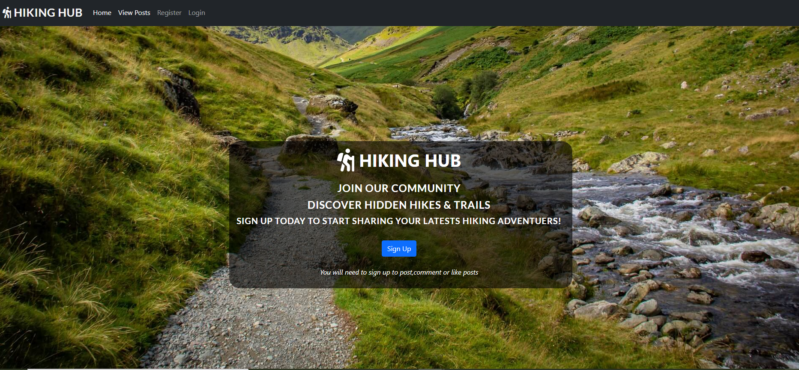
  - Landing page below shows the text displayed when user is logged in.
  - 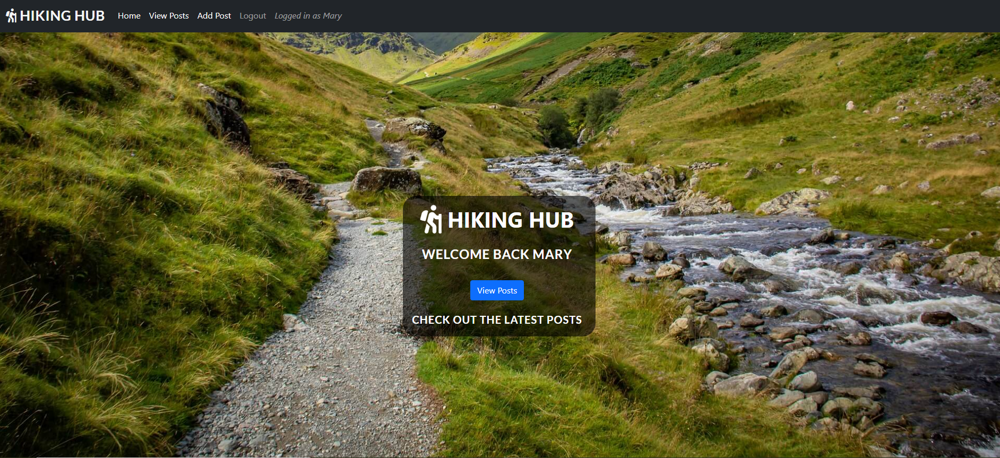

__Why Join Us__

- If the useres scrolls down from the hero image, looking for more information. They will come across the section why join us.
- With the help of Font Awsome and some carefully crafted bullets points of text.It outline key aerea of why the user should sign up to this blog.
- 

__Footer__

  - The footer is simple and clean design it is the same on all pages of the website.
  - It contains 4 social media platforms that will also open in a new window to allow easy navigation for the user.
  - The main aim of the footer is to increase engagement with visitors.With the goal of getting the user to subscribe to the socail channels in order to get updates on new blog post and encouraging useres to be part of the Hiking Hub Community.

 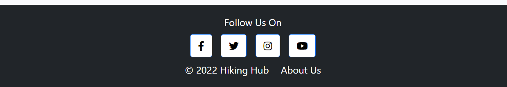

__About Us__

  - About Us section is a very brief description about hiking hub to quickly give the user more information about the website and why we started up this blog.
  - It also highlights the goals of the website so the user can understand and build trust with the blog.
  - 
  

__Post List__
  - On the top nav bar the user can click on view posts. This will bring the user to a page where all the posts are diplayed. 
  -  They are displayed in a card format in 2 rows of three in desktop view. Each card has quick summary of the blog post. Which include Title,Authour, Location, and quick summary of the post,date created and the amount of likes.
  -  When a user is logged in an edit and a delete button will appear on cards. Only on the blog posts the logged in user have created will the buttons appear. To allow them make edits to thier blog posts.
  -  [View Post Summary with buttons](static/images/post_edit.png)
  

__Pagination__
  - When 6 post occupy a page it autamticaly creates a new page, this can be accessed at the bottom of the page. You can press next or previous to navigate between pages.
  - 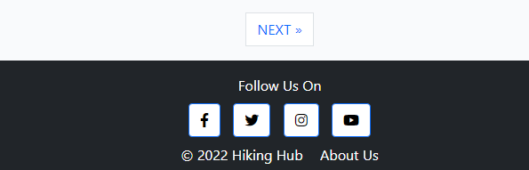
 
__Post Detail__
  -  [View typical post detail page](https://8000-wlillisdev-hikinghub-5qwbva7ia8j.ws-eu54.gitpod.io/cannon-sheehan-loop/)
  - When a post summary card is clicked it will bring the user to a post detail page.
  - This page gives a detiled view of the blog post, It shows featured image, summary of hike detils and a review of the hike.
  - 
  - Buttons for edit and delete post also appear on the blog posts created by the user to allow editing at a later date.

__Comments__
  - At the bottom of the post detail page is a comments section. It displays comments left by useres accompanied with the date.
  - There is also a counter to show how many times a post was liked and how many comments were made.
  - A featuer of the site is that only registerd users can make a comment or like a post, all comments are moderated and must be approved before appearing on site by the admin.
  - 
  - The user will also get an alert message that there comment was submitted
  

__Add Post__
  - If the user is logged in, then they can add a post. The link to adding a post is displayed on the nav bar once the user has logged in.

  - The user is taken to a form with a WYSIWYG editor called Summernote to help them format their content by adding different headings, links, images etc.

  - Once the user has submitted their post, they are taken back to the home page, All post must be approved before final publishing.
  - [View add Post Form](static/images/add_post.png)
  - The user will also get an alert message that there post was submitted
  
  
__Update Post__
  - If the user is logged in, the update post button will be active on th eblog posts they have created.
  - The user will be brought to a form that is prepopulated with the origional blog post details they have written.
  - And edits can be made and update clicked at the bottom of the form and this new content will be now displayed.
  - [View add Update Post  Form](static/images/update_post.png)
   - The user will also get an alert message that there post was updated
  

__Delete Post__
  - If the user decides they want to delete a blog post they have created, they can click on the delete button.
  - As safety the user is brought to a new page incase they clicked on delete button by accident. This page asks again if the user is sure they want to delete the blog post. There is also a cancel button that will return user back to the home page.
  - If deleted the post will be removed from the data base and the user will be redirected to the home page.
  

__Sign Up__
  - The user will be brought to a sign up form if they are new to the site and would like to set up an account. Users will have to register if they want to add posts,comment or like posts.
  - 

__Log in and Log Out Pages__
  - Users that are returning to te blog and want to log back into thier account have a simplified form  that requires just a username and password.
  - 
  - When the user has sucessfully logged in the usere will get an alert message and thier user name diplaed on the nav bar.
  
  - When the user decides to leave and log out of thier account they will be brought to a screen that asks them are they sure they want to log out.
  - 
  - The user will get an alert message if they have sucessfully logged out.
  

__Admin Panel__
  - A superuser was created at the start of this project to manage the administration section.
  - Only approved admin users can access this section of the site and can do so by adding /admin to the URL home page and signing in.
  - The admin has got full CRUD functionality. They can create, read update and delete blog posts. Create draft posts, Delete and approve comments. Delete and add useres. And has the functionality to filter and search though information.
  - 

__Error Pages__
 - Custom error pages were also created for this project.
   - 403 Page Forbiden - Access Forbidden the user does not have permission to access this resource
   - 404 Page Not Found - the user requested a page that is not available
   - 500 Server Error - internal server error 
   - 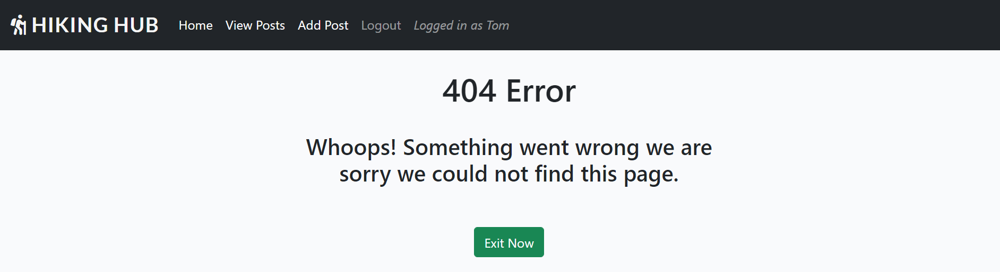

# Design
 - Theme
   - The Theme of the website was to build a bright and engaging hiking blog that had an easy user interface and users could display there posts simply and elegantly. 
   - Fonts were imported from google fonts, Roboto & Lato were chosen.These were picked as they were bold and simple and easy to read and complimented each other and the theme of the site.

 - Data Model
   - Lucid Charts was used to design and visualise the  models used in this project.
   

 - Color Palette
   - The color palette is made up of Three main colors. Although simple they creates a good contrast with each other and helps support the overall theme.The Blue was used mainly for buttons and the grey for a hover effect.

 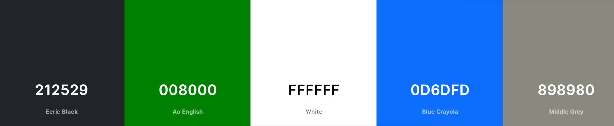

- Imagery
   - The images that were selected for the website were bold and bright images related to the outdoor and hikeing.

- Wireframes
   - To create the initial layout and wireframe I used Balsamiq. This helped fine tune the design and layout. It also helped in calculating the amount of content and images required.(Home Page Below)

  - 
  - [Display Posts Wireframe Concept](static/readme/posts_page_layout.png)
  - [Post Detail Wireframe Concept](static/readme/post_detail_wireframe.png)
   

# Future Development

- User Profiles
  - The user will be able to have a user profile with some info about them and they also be able to view all thier posts they have created in thier profile.

- Categories 
  - As the site grows specific categories will be added, such as difficulty or based on location

- Search functionality
  - A search box could be intergarated tot eh nav bar to allow users to search for trails or hikes.

- Online Shop
  - As the site grows in order to monetize it an online shop can be added. To provide essential hiking supplies for its users.  

# Testing

### Validator Testing 

 - HTML Validator
   - [W3C](https://validator.w3.org/) site was used to validate the **HTML** code.
   - A number of small errors were initially flagged up.
     - [Erros From Validator Hompage](static/readme/error_html.png)
     
 ### All Pages are now error free see links below:

 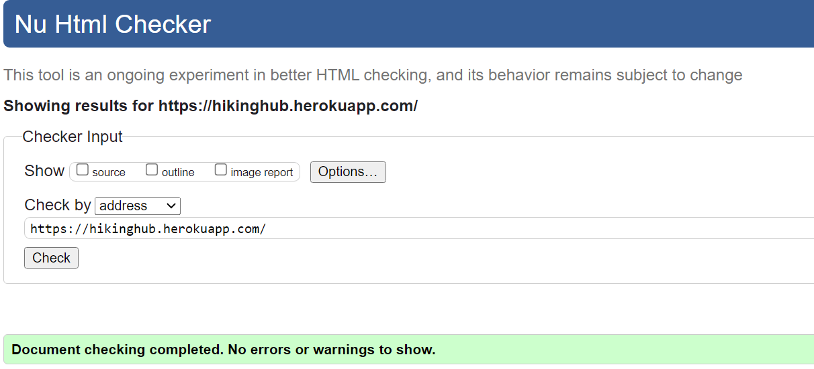
   - [Link to Homepage Test Passed](https://validator.w3.org/nu/?doc=https%3A%2F%2Fhikinghub.herokuapp.com%2F)
   - [Link to About Us Test Passed](https://validator.w3.org/nu/?doc=https%3A%2F%2Fhikinghub.herokuapp.com%2Fabout%2F)
  

## CSS Validator
  - The [W3C](https://validator.w3.org/) was used to validate the **CSS** code
  - The website passed with no errors

  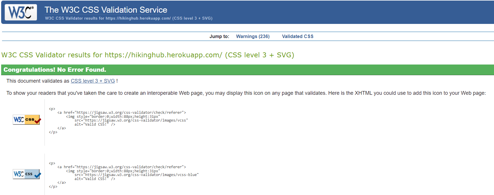

  
   - [Link to CSS Test Results](https://jigsaw.w3.org/css-validator/validator?uri=https%3A%2F%2Fhikinghub.herokuapp.com%2F&profile=css3svg&usermedium=all&warning=1&vextwarning=&lang=en)

  ## Python
  - Python files such as views.py, models.py ect. were run through  [Pep 8 ](http://pep8online.com/)validator and no errors found.
  - [some erros found during testing](static/readme/erros_views_py.png)
  - The Following python files passed testing with pep 8 
  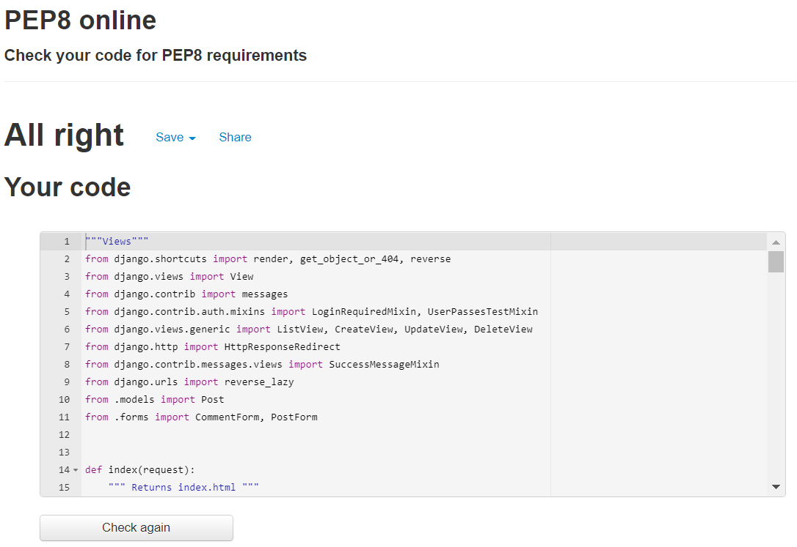
  - [view passed urls.py](static/readme/urls.py_pass.png)
  - [view passed models.py](static/readme/models.py_pass.png)
  - [view passed forms.py](static/readme/forms.py_pass.png)
  - [view passed apps.py](static/readme/app.py_pass.png)
  - [view passed admin.py](static/readme/admin.py_pass.png)

 
## Lighthouse
 - Lighthouse testing was carried out in Developer Tools in Chrome. Initially it gave a number of improvements and flagged up a number of images that needed to be reduced in size. Which was done.
 - [See Light House Before Improvements](static/readme/lighthouse_before.png)
 - The results were also skewed as the chrome extensions on my testing device was affecting the lighthouse results. The tests were redone in a incognito window and performance score increased.Results below from home page
 - Desktop Reults
 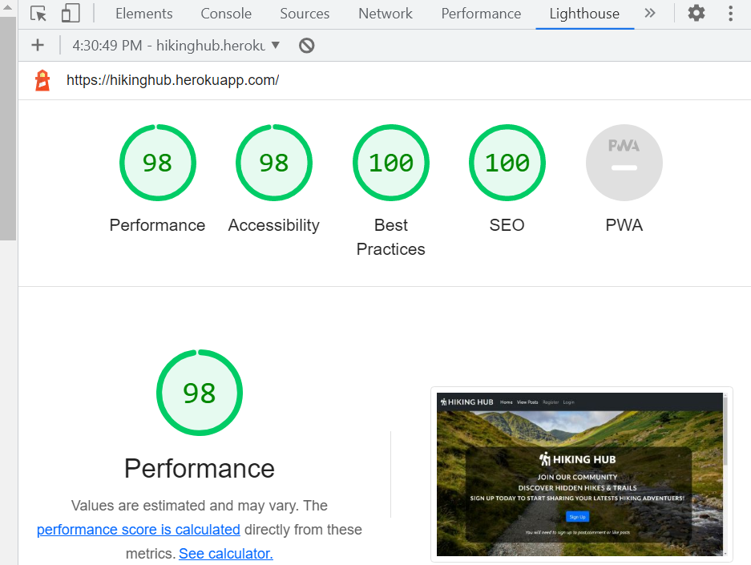
 - [Mobile Light House Results](static/readme/mobile_lighthouse.png)

 
## Manual Testing
  - All the site links were manually tested to see if they all worked ok and linked to the correct locations.
  - The form was checked that name and email were required, that the radio buttons functioned and that the submit button worked.
  - The site was further tested using feedback from mentor,family and friends who checked it on different  devices they had.
  - All of the page's features were tested on Google Chrome, Microsoft Edge, Mozilla Firefox, Safari, and Opera .
  - Google Chrome's Developer Tool was used to inspect page elements during the build and helped identify  and debug issues within the HTML and CSS.
  - The README.md was checked before final submission and links verified.

  ## Manual Feature Testing
  - A structuered approach was taken to go through all of the sites  featuers to see it they worked properly. 
  
  | Feature Tested | Testing Method | Final Result |  
| --- | --- | --- |
| User Register account |- Each mandatory fields was left blank intentionally to check if error messages appeared if form submitted blank | Pass | 
| User Register account - Invalid Email Field | - An invalid email address was tested to ensure error message appeared |  Pass | 
| User login to account - Blank Fields | - All fields were left blank to ensure an error message was displayed to the user |  Pass |
| User login to account - wrong password | - Incorrect user password was intentionally used with wrong spelling and upper and lower case letters and numbers were tested to ensure an error message was displayed to the user  |  Pass |
| User logged in to account - name diplayed in navbar and homepage | - Logged into account with registered user account to see if name displayed in navbar and welcome message  |  Pass |   
| Non registered user - can not add a blog post | - As a not registered user thier is not option in nav bar or other pages for user to add a blog post  |  Pass |
| Non registered user - can not like or comment on posts| - As a not registered user thier is no option to add a blog comment to post. when the heart is clicked on it dose not activate and dose not add a like  |  Pass | 
| User Logged In - User name appears in nav & welcome message| - Logged in a register account. User name appeared in nav bar and also in welcome message on home page|  Pass |
| User Logged In - Add a blog Post in Nav Bar| - Logged in . Add a blog post option appears in the nav bar|  Pass |       
| Create a blog post -  Fields left blank | - This was tested with multiple times with one field being left blank each time. Pass criteria is that alert appears to prevent successful posting until all fields have been completed|  Pass | 
| Create a blog post -  No Featured Image | - Blog post was added with no featured image from user. A  placeholder image was added by default|  Pass |
| Create a blog post -  Unique Title | - A blog post with the same title as an existing post was created, error message displayed appeared saying unique title required |  Pass | 
| Update a blog post -  you are not the authour | - If you are not the autour of a bolg post update button will be hidden from the user a 403 error will occur if /update typed into url |  Pass |
| Update a blog post -  you are the authour | - If you are  the autour of a blog post update button will be visible to the authour |  Pass 
| Update a blog post -  prepopluated fields from blog post | - clicked on update button, update blog post form all the fields were populated from previous blog post |  Pass
| Update a blog post -  update fields on form | - All fields on the prepopulated form were updated and submitted and the blog post content was successfully updated |  Pass
| delete a blog post -  you are not the authour | - If you are not the autour of a bolg post the delete button will be hidden to the user and 403 error will occur if /delete is typed into url |  Pass          
| delete a blog post -  you are the authour | - If you are  the authour of a bolg post  delete buttons will be visible to the authour, on delete the post is successfully removed from website |  Pass
| Alert message - sign in | Alert to confirm user has successfully signed in appears on top of screen. | Pass |  
| Alert message - sign out | Alert requests user to confirm they want to log out before logging out of site, and alert appears you have successfully signed out | Pass |  
| Alert message - Add Comment | Alert your comment was successfully added appears on top of screen | Pass |
| Alert message - Add blog post | Alert your blog post was successfully added appears on top of screen | Pass | 
| Alert message - Update blog post | Alert your blog post was successfully updated appears on top of screen | Pass |
| Admin - restricted access | - Only the admin/superuser account can log into the admin view panel. | Pass |
| Admin Panel - CRUD in the admin panel| - Admin has capability to create, update and delete blog posts,approve and delete comments | Pass |
| Error Alerts - custom error pages| - The Urls were manipulated to test 403,404, & 500 errors, all erros delivered a unique error page | Pass |

## User Sory / Issue Testing
  - All the issues previouly created in git hub at the start of the project were checked to see if the accecptane criteria were met in the final project delivery.

  | Issue | User Story | Acceptance Criteria | Result |  
| --- | --- | --- | --- |
| 1 | As a user, I can register an account so that I can gain access to the full range of features of the blog. | User can register a new account,User can have access to all features of the blog | Pass |
| 2 | As a registered user I can easily login and logout of the blog so that I can access the content i have created. | User can easily login and logout of the site | Pass |
| 3 | As an Admin I can **view, create, edit, update and delete all blog posts ** so that the Admin can easily moderate and control the website's content. | Admin can delete posts,Admin can edit posts,Admin can filter posts,Admin can search posts | Pass |
| 4 | As an admin I can create draft posts so that I can finish writing and editing blog posts later | Admin can create a draft blog post in admin panel | Pass |   
| 5 | As a user I can view a list of trails blog posts so that I can see easily move through the list of trails and pick one I want to read | Trails appear in the paginated list | Pass |   
| 6 | As a user I can see the location of the trail on google maps so that ** i can find out the exact location of the trail to visit there** | User can add click on Google Maps and get directions to the location of the trail. | not included | 
| 7 | As a user I can create a blog post about a trail I have done so that other users can view them | User can create a detailed blog post about a trail they have walked so other users can review and comment on it.User has to be registered in order to create a blog post | Pass | 
| 8 | As a user I can delete blog posts i have created so that I can remove any unwanted trail posts I have made | User can delete blog posts they have created from the website.User can only delete their own content linked to their registered account. | Pass |
| 9 | As a user I can edit my trail blog post so that I can update or make changes to my post | User can make edits and updates to a previously published blog post,User can only their own content | Pass |  
| 10 | As a user I can I can click on a blog post so that I can read the full detailed blog post | User can click on the paginated blog post list and read the full detailed blog post | Pass |
| 11 | As a user I can comment on trail posts so that I can give my feedback & opinion to other users |  User can make a comment on the blog post.User only can only make a comment if they are a registered user. | Pass |
| 12 | As a user or admin I can read comments on a post so that I can read other user's feedback and opinions | Admin can read comments on a blog post.User can read comments on a blog post | Pass |
| 13 | As a user I can view the number of likes on a blog post so that I can see which is the most popular hiking trail |  user can view the total number of likes given to an individual blog post | Pass |
| 14 | As an admin I can **approve or disapprove comments made ** so that I can filter out inappropriate comments |  admin can moderate and quickly filter comments and easily approve and delete comments in the admin panel of the blog | Pass |
| 15 | As a user I can understand the website's purpose quickly so that I know if its what I'm looking for |   User can quickly understand website's purpose and what to do next from the homepage of the website | Pass |
| 16 | As a user I can register an account with a social network so that **I can quickly register my account ** |   User can register an account using their Google/Facebook account info | not included |
| 17 | As a user I can get links to important information related to hiking so that so i can get important information related to the hill walking & safety |   user can access important information in relation to hillwalking | not included |
| 18 | As a user I can buy hiking equipment from the website so that ** I can be prepared for my next hike based on user's comments & recommendations** |   user can buy hiking related equipment and clothing from the website | not included |

  
# Fixed Bugs

  - After running the site through HTML checker, a number of small bugs were identified. Each error was identified and an appropriate solution applied, i went through all pages and fixed any errors. It was good lesson and practice in finding problems with code and fixing them.
  - After Running all the pages through lighthouse, it identified issues with a number of images due to size. Lighthouse suggested to change some larger images which was done.
  - Initially  i had a mouse over event listener  on google maps markers but this was no use for mobile which i realised  when testing, so i changed it to onclick event.
  - I had eval in my validate quiz function, jshint gave this as a warning and a potential security risk so i removed it.
  

  # Unfixed Bugs
  - I am aware there is a console.log Error with Permissions-Policy header: Unrecognized feature: 'interest-cohort'.From what i have researched this is a issue between Github and Google and has no effect on the sites performance.
  - I am aware the website has a lot of large rich images and although images were cropped and compressed it could lead to reduced speed until cached. I have experimented with next gen image formats but currently  they lack browser compatibility  so i just went with png compressed and cropped format for this site.

# Deployment

The site was deployed via Heroku.
1.  Log in to Heroku or create an account if required.
2.  Then, click the button labelled New from the dashboard in the top right corner and from the drop-down menu select Create New App.  You must enter a unique app name
3.  Next, select your region.
4.  Click on the Create App button.
5.  In your app go to Resources tab and add a Heroku Postgres database.
6.  The next page you will see is the project’s Deploy Tab. Click on the Settings Tab and scroll down to Config Vars and enter:
    *   CLOUDINARY_URL = your cloudinary key 
    *   DATABASE_URL = the url of your heroku postgres database
    *   SECRET_KEY = a secret key for your app.
    *   PORT = 8000
    *   DISABLE_COLLECTSTATIC = 1 during development and remove when deploying to production

7.  Scroll to the top of the page and now choose the Deploy tab.
8.  Select Github as the deployment method.
9.  Confirm you want to connect to GitHub.
10. Search for the repository name and click the connect button.
11. Scroll to the bottom of the deploy page and select preferred deployment type:
12. Click either Enable Automatic Deploys for automatic deployment when you push updates to Github.
13. Select the correct branch for deployment from the drop-down menu and click Deploy Branch for manual deployment.

NB: Ensure in Django settings, DEBUG is False, create a Procfile and save database and cloudinary urls and secret key to env.py.

 ## Version Control
  - Git was used as the version control software. Commands such as git add ., git status, git commit and git push were used to add, save, stage and push the code to the GitHub repository.

## Cloning

1. On [GitHub](www.github.com), navigate to the main page of the repository.  [Click Here for Reposititory Link](https://github.com/wlillisdev/quiz-master)

2. Above the list of files, click Code.

3. click Use GitHub CLI, then click the copy icon.

4. Open Git Bash and change the current working directory to the location where you want the cloned directory.

5. Type git clone, and then paste the URL that was copied previously  in step 3.

6. Press Enter to create the local clone.

[git cloning steps with pictuers](https://docs.github.com/en/repositories/creating-and-managing-repositories/cloning-a-repository#cloning-a-repository-to-github-desktop)

# Technologies Used

- ## Languages

  - [HTML5](https://en.wikipedia.org/wiki/HTML5)
    - Python Web Server Gateway to Heruko
  - [CSS](https://en.wikipedia.org/wiki/CSS)
    - Python Web Server Gateway to Heruko
  - [Python](https://www.python.org/)
    - Python Web Server Gateway to Heruko

- ## Frameworks

  - [Django](https://www.djangoproject.com/)
    - Python Web Server Gateway to Heruko
  - [Bootstrap](https://getbootstrap.com/)
    - Python Web Server Gateway to Heruko
  - [Django-allauth](https://django-allauth.readthedocs.io/en/latest/)
    - Python Web Server Gateway to Heruko

- ## Databases

  - [SQLite](https://www.sqlite.org/index.html)
    - Database during development 
  - [PostgreSQL](https://www.postgresql.org/)
    - Database used to store all the data on deployment

- ## Django Packages

  - [gunicorn](https://gunicorn.org/)
    - Python Web Server Gateway to Heruko
  - [psycopg2](https://pypi.org/project/psycopg2/)
    - Python Web Server Gateway to Heruko
  - [Summernote](https://summernote.org/)
    - Python Web Server Gateway to Heruko
  - [Cloudinary](https://cloudinary.com/)
    - Python Web Server Gateway to Heruko
  - [Crispy Forms](https://django-crispy-forms.readthedocs.io/en/latest/)
    - Python Web Server Gateway to Heruko
  
-  ## Tools
   - [Balsamiq](https://balsamiq.com/) - Used to create wireframes
   - [Google Fonts](https://fonts.google.com/) - Used to import fonts
   - [TinyPNG](https://tinypng.com/) - Used to compress images

- ## Credits
   - The code for the contact us form was taken from the love running tutorial from [Code Institute](https://codeinstitute.net/ie/) and modified.
   - The icons used throughout the site were from [Font Awesome](https://fontawesome.com/)
   - Variour Youtube tutorial were used to help understand flexbox.
   - [Flexbox](https://www.youtube.com/watch?v=fYq5PXgSsbE)
   - Animated Text on home page from [bulldogpatch](https://codepen.io/bulldogpatch-the-sasster/pen/JjoyeGg)
   - Tutorials for Randon Fact generator from freecode camp ,learn web-dev & dev.to were used to inspire the generator.
   - YouTube videos from Eduonix Learning Solutions,Kevin Briggs & Web Dev Simplified were used as a base for the quizz.
   - Youtube videos about google maps api with javascript were followed from Traversy Media & Sam Codes.

-  ## Images
   - All images were taken from [Pexels](https://www.pexels.com/)

  
 -  ## Resources
    - [Stack Overflow](https://stackoverflow.com/)
    - [W3Schools](https://www.w3schools.com/)
    - [w3docs](https://www.w3docs.com/)
    - Notes & Videos from course work from [Code Institute](https://codeinstitute.net/ie/)

-  ## Acknowledgements
 - Special thanks to my mentor Miguel Martinez
 for his help and guidance in the development of my project. Special thanks to my tutor Kasia and our regular class meeting’s and members of the awesome slack community

   # Conclusion
    - I would like to experiment more with javaScript but as i am only getting to grips with the language i kept the concept simple.
    - If I was to build this site again, I would spend more time on the wireframes and know exactly how to structure each section and element before i start.
    - If i had time i would like to add a timer function to the quizz.    
    - I would also learn to make more commits during the project built.
