# Hiking Hub

- You can see the live website [here](https://hikinghub.herokuapp.com/)..

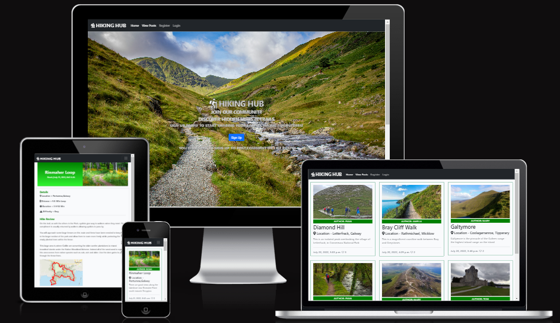

This website is designed for Hiking Hub. Their aim is to become the go to blog for everting to do with hikeing in Ireland.

# Aim of Website

The goal of this website is to create a hiking community blog. To provide a platform so users can share thier hiking adventuers. This blog will enabel users to upload thier own unique hike reviews, And share with others thier expeierence they had on a particular hike or trail. So other users can discover hiden gems of hikes and trails all over Ireland.

# Target Audience

 Hiking is an activity enjoyed by all age groups. But is it recommend that users be aware of the risks involved with hikeing. And not attempt difficult trails if you do not have a guide,relevant experience, proper equipment,colthing and supplies. Primarly the website will be aimed at hikeing enthuists 25+ based in Ireland  

# User Experience (UX)

### User Stories
- First Time Visitors Aims:
  - As a first-time visitor, I want to quickly and easily understand what this website is about and what it can do for me.
  - As a first-time visitor, I want to be able to easily navigate around the site to find the content I'm looking for.
  - As a first-time visitor, I want to be able to register and create an account to get full access to blog
  - As a first-time visitor, I want to quickly view a summary of blog posts on one page.
  - As a first-time visitor, I want to click on a blog post and view the post in detail.
  - As a first-time visitor, I want to be able to see comments and the amount of likes on a blog post.

- Returning Visitors Aims (logged in):
  - As a returning visitor, I would like to be able to add a blog post of my hike.
  - As a returning visitor, I would like to be able to update the content on my blog post.
  - As a returning visitor, I would like to be able to delete my blog post.
  - As a returning visitor, I would like to be able to comment and like and unlike a blog post.
  - As a returning visitor, I would like to be able to quickly log in and log out of my account.
  - As a returning visitor, I would like to find links to their social media channels and follow them.

- Admin super user Aims:
  - As a super user, I want to be able create a blog post from admin panel.
  - As a super user, I want to be able create a draft post so i can finish at a later date.
  - As a super user, I want to be able filter and search through data quickly and easily.
  - As a super user, I want to be able to approve or Delete users blog posts.
  - As a super user, I want to be able to approve or delete comments.

# Agile Approach to Project Devlopment

An agile approach was taken in the devlopment of this project. The project will be  disected into smaller parts and an iterative approach to project management and software development will be used to achieve faster development of the project and optomise time usage.

- MoSoCoW Method:
  - I will also aim to intergate the MoSoCoW Method in to this project. Which is a four-step approach to prioritizing which project requiremnets need to be carried out first in order to achieve project goals and user stories with the first iteration been a fully functioning website. Custom labels will be created in github and allocated to each requirment so they can be easily filtered and identified.

  

- User Stories
  - The whole project was broken down in 18 indivudal user stories,each user story was a self contined devlopemnt mini project that helped reach the overall goal of the website.They were enter into github as github issues.
  - [View List of 18 User Stories](https://github.com/wlillisdev/hiking-hub/issues)
  - Specific accecptance critea was allocated for each user story and a list of  tasks were also established. Each task would need to be completed so accecptance critea is met.See example below.
  
  - The Moscow method was then applied to eash user story. And tags were applied to priortise the order of work.
  - [Example of MOSCOW tags](static/readme/must_have.png)
  - The users stories were then put in to 2 iterations. Iteration 1 had 14 user stories and these were deemed essential for the inital launch of the website. Iteration 2 currently has 4 user stories that will be carried out at a later date.
  - [View Project Iterations](https://github.com/wlillisdev/hiking-hub/milestones)
  - A Kanban board was set up in github in order to manage the various project user stories. It was devided into 3 main areas to track rhw progress. To Do, In Progress,Done,
  
  -[View Kanban Board](https://github.com/wlillisdev/hiking-hub/projects/1)
  
 
# Features 

 [View Homepage Featuers](https://hikinghub.herokuapp.com/)

__Favicon__
 - As hiking is the theme of the website an icon of a person hiking was used, I came across a solution on stack overflow on how to turn font awsome logo in to favicon. Click [here](https://gauger.io/fonticon/)
  

__Navigation Bar__
 
  - The Navigation bar is located at the top of all  Pages. It is simple but clean design. It includes the logo, Home page, View Posts, Login & Register. this appears to users that are not logged in.
  - If a user has logged it changes, Add Post appears and logout becomes active in the nav bar. It will also display the name of logged in user.
  - It will allow a visitor to quickly and easily get around the site as each link logically leads to the next.
  - The nav elements also change colour when hovered which adds to the user experience.
  - The nav bar is responsive and collpases in to hangburger menu when on smaller screens.   
  - The nav bar below user logged in view.
  
  - The responsive nav bar below.
  - 

 
__Landing Page__

  - The landing page contains an eye-catching background image of a beautiful landscpae with a trail by a stream and immediately catched a users attention.
  - The text on the screen clearly tells the user whats the site is about and what the user needs to do next. And they are encourage to sign up with a bold sign up button.
  - The hero image also has a Parallax Scrolling Effect with the text.
  - The text on the home screen changes depending on if the usere is logged in or not.
  - Landing page below shows the text displayed when new user viditd the siteand is not registered.
  - 
  - Landing page below shows the text displayed when user is logged in.
  - 

__Why Join Us__

- If the useres scrolls down from the hero image, looking for more information. They will come across the section why join us.
- With the help of Font Awsome and some carefully crafted bullets points of text.It outline key aerea of why the user should sign up to this blog.
- 

__Footer__

  - The footer is simple and clean design it is the same on all pages of the website.
  - It contains 4 social media platforms that will also open in a new window to allow easy navigation for the user.
  - The main aim of the footer is to increase engagement with visitors.With the goal of getting the user to subscribe to the socail channels in order to get updates on new blog post and encouraging useres to be part of the Hiking Hub Community.

 

__About Us__

  - About Us section is a very brief description about hiking hub to quickly give the user more information about the website and why we started up this blog.
  - It also highlights the goals of the website so the user can understand and build trust with the blog.
  - 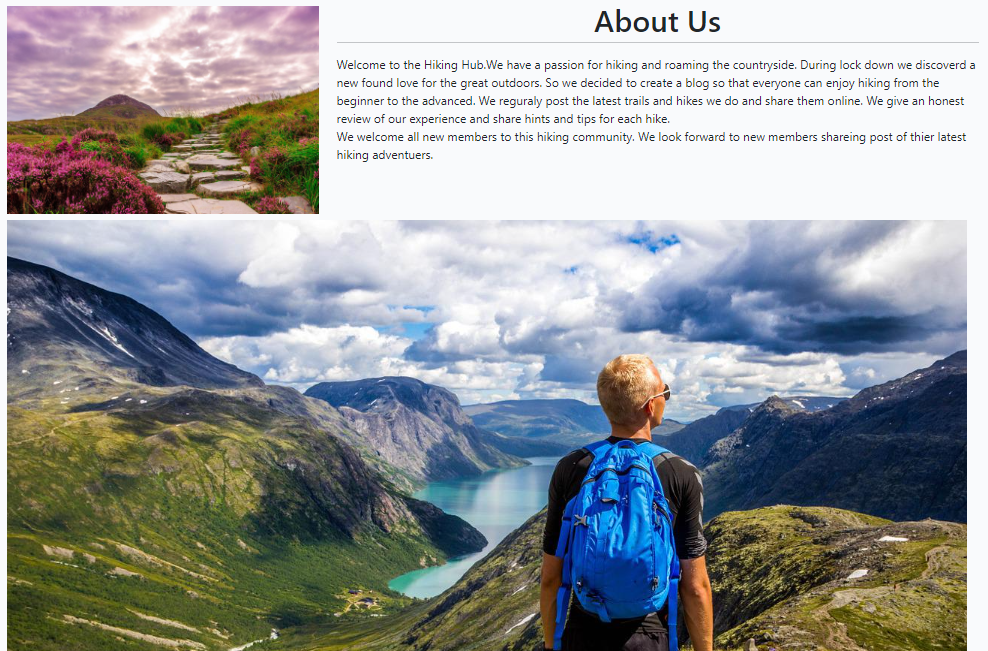
  

__Post List__
  - On the top nav bar the user can click on view posts. This will bring the user to a page where all the posts are diplayed. 
  -  They are displayed in a card format in 2 rows of three in desktop view. Each card has quick summary of the blog post. Which include Title,Authour, Location, and quick summary of the post,date created and the amount of likes.
  -  When a user is logged in an edit and a delete button will appear on cards. Only on the blog posts the logged in user have created will the buttons appear. To allow them make edits to thier blog posts.
  -  [View Post Summary with buttons](static/images/post_edit.png)
  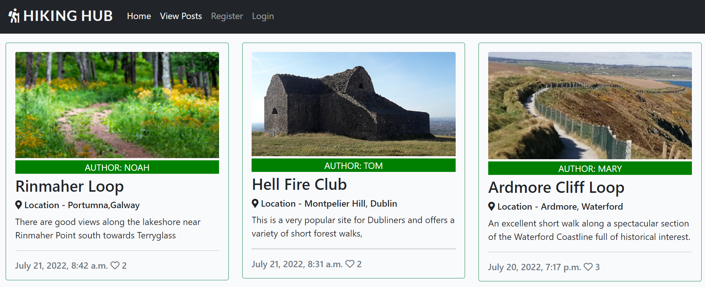

__Pagination__
  - When 6 post occupy a page it autamticaly creates a new page, this can be accessed at the bottom of the page. You can press next or previous to navigate between pages.
  - 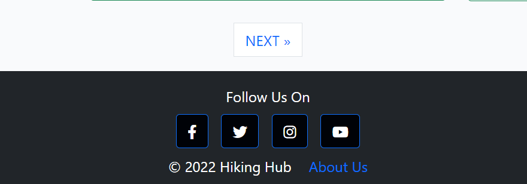
 
__Post Detail__
  -  [View typical post detail page](https://8000-wlillisdev-hikinghub-5qwbva7ia8j.ws-eu54.gitpod.io/cannon-sheehan-loop/)
  - When a post summary card is clicked it will bring the user to a post detail page.
  - This page gives a detiled view of the blog post, It shows featured image, summary of hike detils and a review of the hike.
  - 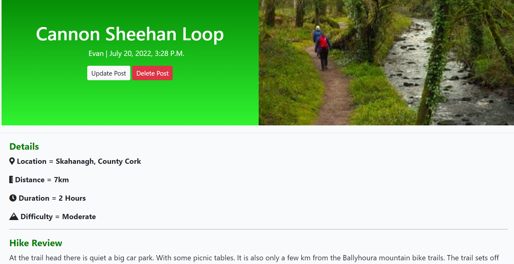
  - Buttons for edit and delete post also appear on the blog posts created by the user to allow editing at a later date.

__Comments__
  - At the bottom of the post detail page is a comments section. It displays comments left by useres accompanied with the date.
  - There is also a counter to show how many times a post was liked and how many comments were made.
  - A featuer of the site is that only registerd users can make a comment or like a post, all comments are moderated and must be approved before appearing on site by the admin.
  - 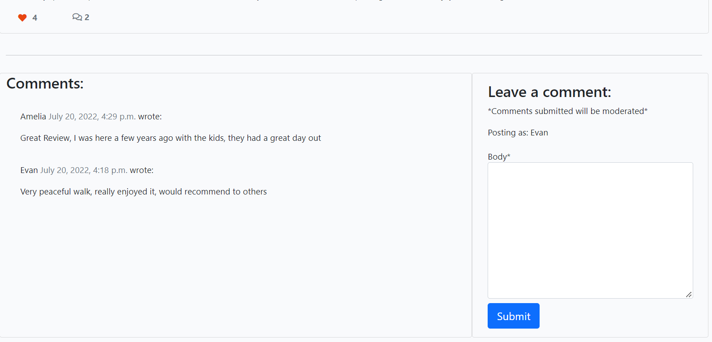
  - The user will also get an alert message that there comment was submitted
  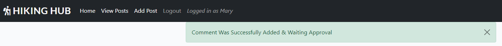

__Add Post__
  - If the user is logged in, then they can add a post. The link to adding a post is displayed on the nav bar once the user has logged in.

  - The user is taken to a form with a WYSIWYG editor called Summernote to help them format their content by adding different headings, links, images etc.

  - Once the user has submitted their post, they are taken back to the home page, All post must be approved before final publishing.
  - [View add Post Form](static/images/add_post.png)
  - The user will also get an alert message that there post was submitted
  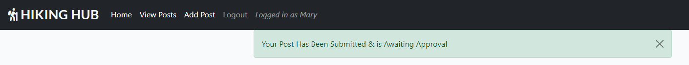
  
__Update Post__
  - If the user is logged in, the update post button will be active on th eblog posts they have created.
  - The user will be brought to a form that is prepopulated with the origional blog post details they have written.
  - And edits can be made and update clicked at the bottom of the form and this new content will be now displayed.
  - [View add Update Post  Form](static/images/update_post.png)
   - The user will also get an alert message that there post was updated
  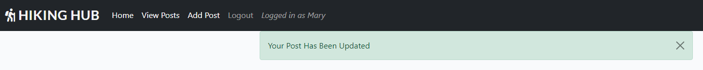

__Delete Post__
  - If the user decides they want to delete a blog post they have created, they can click on the delete button.
  - As safety the user is brought to a new page incase they clicked on delete button by accident. This page asks again if the user is sure they want to delete the blog post. There is also a cancel button that will return user back to the home page.
  - If deleted the post will be removed from the data base and the user will be redirected to the home page.
  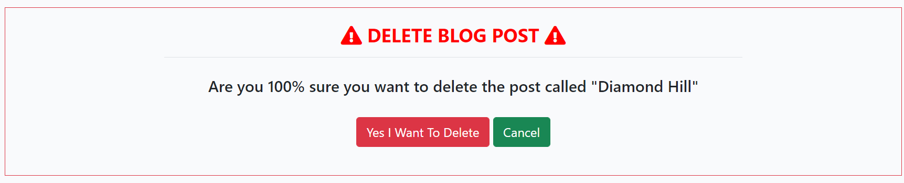

__Sign Up__
  - The user will be brought to a sign up form if they are new to the site and would like to set up an account. Users will have to register if they want to add posts,comment or like posts.
  - 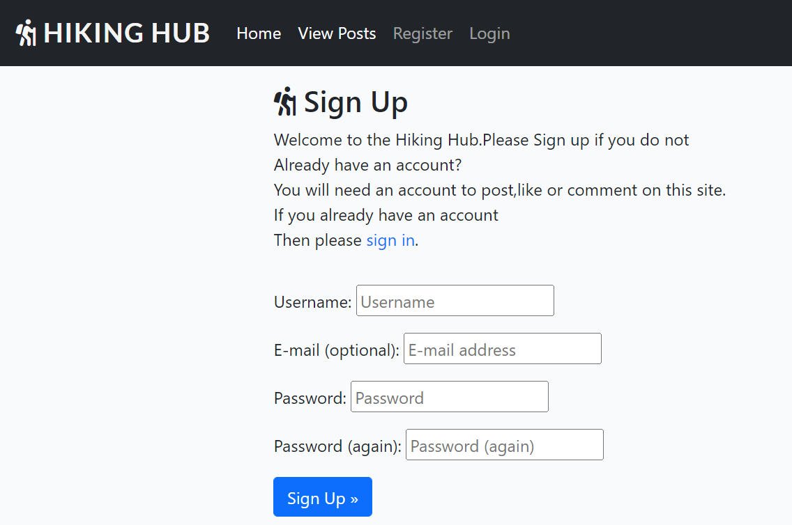

__Log in and Log Out Pages__
  - Users that are returning to te blog and want to log back into thier account have a simplified form  that requires just a username and password.
  - 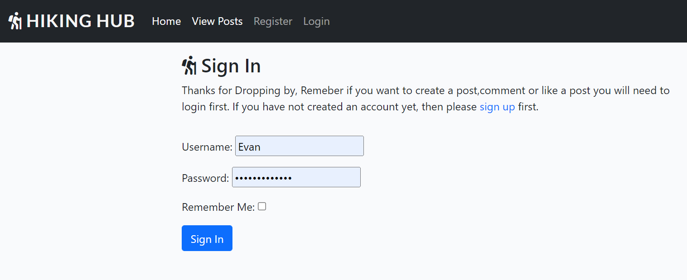
  - When the user has sucessfully logged in the usere will get an alert message and thier user name diplaed on the nav bar.
  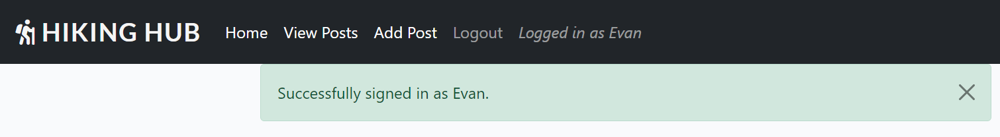
  - When the user decides to leave and log out of thier account they will be brought to a screen that asks them are they sure they want to log out.
  - 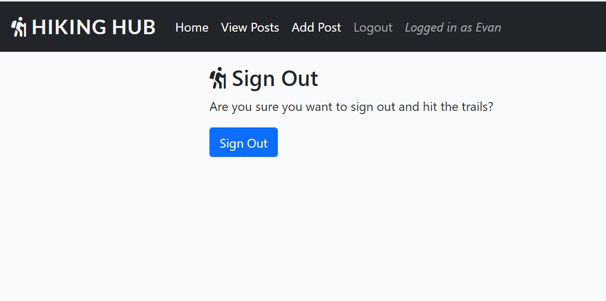
  - The user will get an alert message if they have sucessfully logged out.
  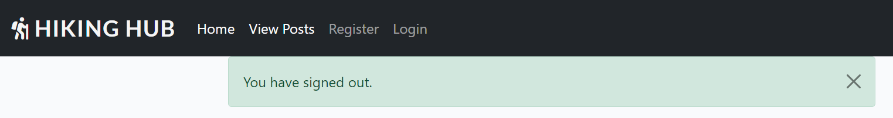

__Admin Panel__
  - A superuser was created at the start of this project to manage the administration section.
  - Only approved admin users can access this section of the site and can do so by adding /admin to the URL home page and signing in.
  - The admin has got full CRUD functionality. They can create, read update and delete blog posts. Create draft posts, Delete and approve comments. Delete and add useres. And has the functionality to filter and search though information.
  - 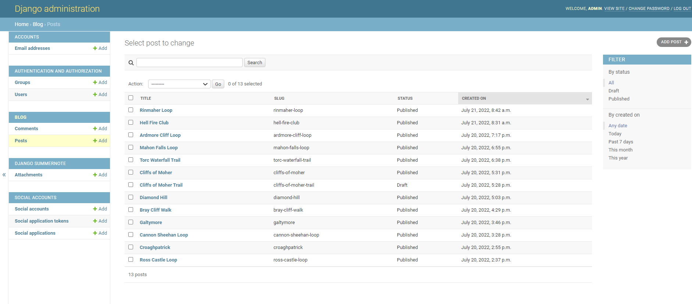

__Error Pages__
 - Custom error pages were also created for this project.
   - 403 Page Forbiden - Access Forbidden the user does not have permission to access this resource
   - 404 Page Not Found - the user requested a page that is not available
   - 500 Server Error - internal server error 

# Design
 - Theme
   - The Theme of the website was to build a bright and engaging hiking blog that had an easy user interface and users could display there posts simply and elegantly. 
   - Fonts were imported from google fonts, Boogaloo was used for the logo and nav menu, Libre Franklin for hompage hero text, Montserrat for headings, and Roboto for body text.These were picked as they were crisp and complimented each other and the theme of the site.

 - Data Model
   - Lucid Charts was used to design and visualise the  models used in this project.
   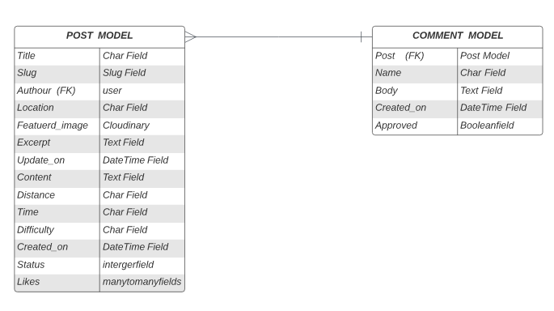

 - Color Palette
   - The color palette is made up of Three main colors. Although simple it  which creates a good contrast and helps support the overall theme.The Blue was used mainly for buttons and the grey for a hover effect.

 

- Imagery
   - The images that were selected for the website were bold and bright images related to the outdoor and hikeing.

- Wireframes
   - To create the initial layout and wireframe I used Balsamiq. This helped fine tune the design and layout. It also helped in calculating the amount of content and images required.(Home Page Below)

  - 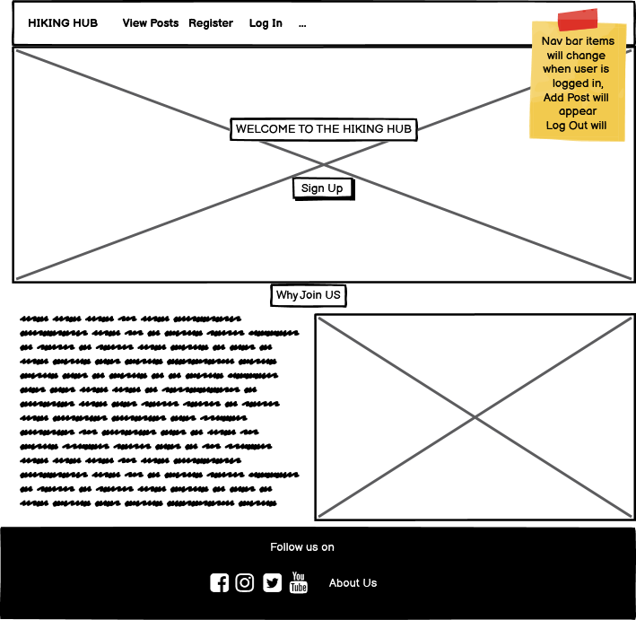
  - [Display Posts Wireframe Concept](static/readme/posts_page_layout.png)
  - [Post Detail Wireframe Concept](static/readme/post_detail_wireframe.png)
   

# Future Development

- More Quiz Topics
  - As the site grows so will the resource of quiz topics and questions.

  - As the site grows we will intergrate an API into the random fact generator to generate an  infinite amount of new facts.        

- Children Quizzes 
  - Children Quizzes section will be added at a later date, to broaden the reach of the website.

- Subscription Section
  - The site will initially  have a number of quizzes free for everyone. But there will be an option for users to sign up to a monthly subscription service where they get exclusive quizzes every month.

- Other Games
  - As the site evolves  so will the amount of games on the site, initially  it is just quizzes, but it eventually have Crosswords, Word Search & Cryptograms.  

# Testing

### Validator Testing 

 - HTML Validator
   - [W3C](https://validator.w3.org/) site was used to validate the **HTML** code.
   - A number of small errors were initially flagged up. Some duplicate tags were removed and I also had to rename a number of images. I also misplaced a link tag in the homepage, as I copied this page structure for the rest of the site i had to fix it on all of these pages also
     - [Erros From Validator Hompage](assets/readme/html-home-error.png)
     - [Erros From Validator Quizzes](assets/readme/error-validator-quizzes.png)
     - [Erros From Validator Triva Quiz](assets/readme/validaor-error-triva-quiz.png)

   

 ### All Pages are now error free see links below:

 
   - [Homepage](https://validator.w3.org/nu/?doc=https%3A%2F%2Fwlillisdev.github.io%2Fquiz-master%2Findex.html)
   - [Quizzes Page](https://validator.w3.org/nu/?doc=https%3A%2F%2Fwlillisdev.github.io%2Fquiz-master%2Fquizzes.html)
   - [Triva Quizz](https://validator.w3.org/nu/?doc=https%3A%2F%2Fwlillisdev.github.io%2Fquiz-master%2Fquizz-triva.html) Error because image is hidden until event happens
   - [Sport Quizz](https://validator.w3.org/nu/?doc=https%3A%2F%2Fwlillisdev.github.io%2Fquiz-master%2Fsport-quizz.html) Error because image is hidden until event happens
   - [Film Quizz](https://validator.w3.org/nu/?doc=https%3A%2F%2Fwlillisdev.github.io%2Fquiz-master%2Ffilm-quizz.html) Error because image is hidden until event happens
   - [Film Quizz](https://validator.w3.org/nu/?doc=https%3A%2F%2Fwlillisdev.github.io%2Fquiz-master%2Fmusic-quizz.html) Error because image is hidden until event happens
   - [Contact Us Page](https://validator.w3.org/nu/?doc=https%3A%2F%2Fwlillisdev.github.io%2Fquiz-master%2Fcontact-us.html)
   - [Thank You Page](https://validator.w3.org/nu/?doc=https%3A%2F%2Fwlillisdev.github.io%2Fquiz-master%2Fthank-you.html)

## CSS Validator
  - The [W3C](https://validator.w3.org/) was used to validate the **CSS** code
  - The website passed with no errors

  

  ### See links below for Results:

   - [CSS Test Results](https://jigsaw.w3.org/css-validator/validator?uri=https%3A%2F%2Fwlillisdev.github.io%2Fquiz-master%2Findex.html&profile=css3svg&usermedium=all&warning=1&vextwarning=&lang=en)

 
## Lighthouse
 - Lighthouse testing was carried out in Developer Tools in Chrome. Initially it gave a number of improvements and flagged up a number of images that needed to be reduced in size. Which was done.

 - The results were also skewed as the chrome extensions on my testing device was affecting the lighthouse results. The tests of all pages were redone in a incognito window and performance score increased.

 
 - [Quizzes Page lighthouse results](assets/readme/quizzes-pages-lighthouse.png) results are slightly down mainly due to the integration  of google maps api.
 - [Contact Us lighthoust results](assets/readme/contact-lighthouse-crop.png)

 ## JavaScript
 - The [JShint](https://jshint.com/) was used to validate the **JavaScrip** code
 - The results initally highlighted a few warnings.
     - [Erros From JShint](assets/readme/jshint-error.png)
     
 - Each item was addressed, The validation loop for the quizz was edited to remove eval as Jshint highlighted it could be harmful for security issues. And stack overflow suggested adding / /*jshint esversion: 6 */ to the notes this prevented this error.

 
 
## Manual Testing
  - All the site links were manually tested to see if they all worked ok and linked to the correct locations.
  - The form was checked that name and email were required, that the radio buttons functioned and that the submit button worked.
  - The site was further tested using feedback from mentor,family and friends who checked it on different  devices they had.
  - All of the page's features were tested on Google Chrome, Microsoft Edge, Mozilla Firefox, Safari, and Opera .
  - Google Chrome's Developer Tool was used to inspect page elements during the build and helped identify  and debug issues within the HTML and CSS.
  - The README.md was checked before final submission and links verified.

# Bugs

  - After running the site through HTML checker, a number of small bugs were identified. Each error was identified and an appropriate solution applied, i went through all pages and fixed any errors. It was good lesson and practice in finding problems with code and fixing them.
  - After Running all the pages through lighthouse, it identified issues with a number of images due to size. Lighthouse suggested to change some larger images which was done.
  - Initially  i had a mouse over event listener  on google maps markers but this was no use for mobile which i realised  when testing, so i changed it to onclick event.
  - I had eval in my validate quiz function, jshint gave this as a warning and a potential security risk so i removed it.
  

  # Unfixed Bugs
  - I am aware there is a console.log Error with Permissions-Policy header: Unrecognized feature: 'interest-cohort'.From what i have researched this is a issue between Github and Google and has no effect on the sites performance.
  - I am aware the website has a lot of large rich images and although images were cropped and compressed it could lead to reduced speed until cached. I have experimented with next gen image formats but currently  they lack browser compatibility  so i just went with png compressed and cropped format for this site.

# Deployment

The site was created using Visual Studio Code and GitHub, and deployed to GitHub pages for testing using the below process:

 - Clicked on my respository for [wlillisdev/quizz-master](https://github.com/wlillisdev/quiz-master).
 - Clicked settings tab and navigated down to "pages"
 - Selected "Main" in branch drop down box.
 - Clicked "save" which produced the live link which can be viewed [here](https://wlillisdev.github.io/quiz-master/).. 

 ## Version Control
  - Git was used as the version control software. Commands such as git add ., git status, git commit and git push were used to add, save, stage and push the code to the GitHub repository.

## Cloning

1. On [GitHub](www.github.com), navigate to the main page of the repository.  [Click Here for Reposititory Link](https://github.com/wlillisdev/quiz-master)

2. Above the list of files, click Code.

3. click Use GitHub CLI, then click the copy icon.

4. Open Git Bash and change the current working directory to the location where you want the cloned directory.

5. Type git clone, and then paste the URL that was copied previously  in step 3.

6. Press Enter to create the local clone.

[git cloning steps with pictuers](https://docs.github.com/en/repositories/creating-and-managing-repositories/cloning-a-repository#cloning-a-repository-to-github-desktop)

# Credits

- ## Languages

  - [HTML5](https://en.wikipedia.org/wiki/HTML5)
  - [CSS](https://en.wikipedia.org/wiki/CSS)
  - [JavaScript](https://en.wikipedia.org/wiki/JavaScript)

- ## Content
   - The code for the contact us form was taken from the love running tutorial from [Code Institute](https://codeinstitute.net/ie/) and modified.
   - The icons used throughout the site were from [Font Awesome](https://fontawesome.com/)
   - Variour Youtube tutorial were used to help understand flexbox.
   - [Flexbox](https://www.youtube.com/watch?v=fYq5PXgSsbE)
   - Animated Text on home page from [bulldogpatch](https://codepen.io/bulldogpatch-the-sasster/pen/JjoyeGg)
   - Tutorials for Randon Fact generator from freecode camp ,learn web-dev & dev.to were used to inspire the generator.
   - YouTube videos from Eduonix Learning Solutions,Kevin Briggs & Web Dev Simplified were used as a base for the quizz.
   - Youtube videos about google maps api with javascript were followed from Traversy Media & Sam Codes.

    

-  ## Images
   - All images were taken from [Pexels](https://www.pexels.com/)

  
 -  ## Resources
    - [Stack Overflow](https://stackoverflow.com/)
    - [W3Schools](https://www.w3schools.com/)
    - [w3docs](https://www.w3docs.com/)
    - Notes & Videos from course work from [Code Institute](https://codeinstitute.net/ie/)

-  ## Tools
   - [Balsamiq](https://balsamiq.com/) - Used to create wireframes
   - [Google Fonts](https://fonts.google.com/) - Used to import fonts
   - [TinyPNG](https://tinypng.com/) - Used to compress images

-  ## Acknowledgements
 - Special thanks to my mentor Miguel Martinez
 for his help and guidance in the development of my project. Special thanks to my tutor Kasia and our regular class meeting’s and members of the awesome slack community

   # Conclusion
    - I would like to experiment more with javaScript but as i am only getting to grips with the language i kept the concept simple.
    - If I was to build this site again, I would spend more time on the wireframes and know exactly how to structure each section and element before i start.
    - If i had time i would like to add a timer function to the quizz.    
    - I would also learn to make more commits during the project built.
